# HK ליועצים — קטלוג הפיצ'רים המלא

*נבנה מהפרוטוטיפ החי · כל הצילומים מ-`docs/shots/` · ספטמבר 2026*

**בשורה אחת:** HK לוקחת מהיועץ העסקי את כל מה שאינו ייעוץ — תפעול,
הקלדות, רדיפות אחרי חומר, זיכרון, הכנות וסיכומים — ומשאירה לו את השעה
שבה הוא שווה כסף: מול הלקוח.

**המתמטיקה שמאחורי זה:** תפעול תזרים ידני עולה 4–8 שעות לחודש פר לקוח.
זה מה שמקבע יועץ טוב סביב 8–10 לקוחות. HK מורידה את השעות האלה לאפס —
ומשם 25–30 לקוחות הם עניין של יכולת ייעוץ, לא של שעות הקלדה.

---

## המבנה — ארבעה עמודים, לפי סדר החשיבות

| # | עמוד | למה הוא במקום הזה |
|---|---|---|
| 1 | [התפעול](#1--התפעול) | היחיד שהוא שירות ולא תוכנה. אי אפשר להעתיק אותו בפיצ'ר |
| 2 | [הזיכרון](#2--הזיכרון) | מה שהופך את המערכת לבלתי־ניתנת להחלפה אחרי שנה |
| 3 | [התקשורת](#3--התקשורת) | כל מה שנאמר ללקוח, בארבעה ערוצים, במקום אחד |
| 4 | [המספרים](#4--המספרים) | המוצר שהלקוח משלם עליו — ברמת CFO |
| + | [מה הלקוח מקבל](#5--מה-הלקוח-מקבל) | השימור. הלקוח מרגיש מטופל כל החודש, לא רק בפגישה |
| + | [הניהול](#6--הניהול) | מה שמאפשר למשרד לגדול |

---

## 1 · התפעול

> מנהל תזרים של HK מריץ לכל חברה, כל חודש, את כל שרשרת התפעול.
> היועץ לא נוגע בזה — הוא מקבל תזרים מוכן ובדוק.

### 1.1 תור התפעול

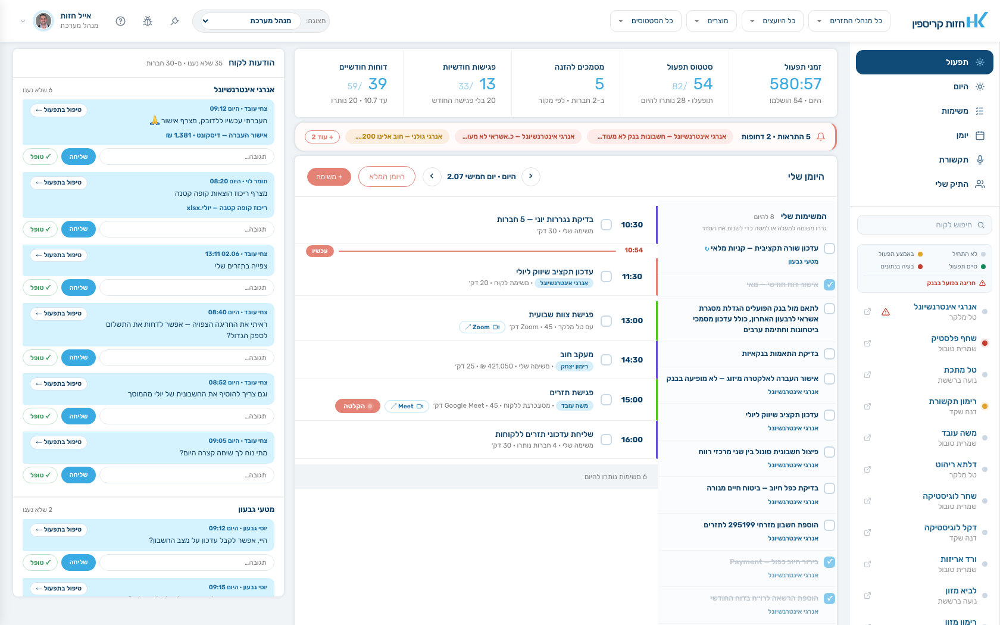

מבט־על על כל החברות: מי ממתין לחומר, למי יש נגררות, מי חורג. כל חברה
נכנסת לתור עם מה שנשאר לעשות בה, וזמן התפעול נמדד פר חברה — כך שידוע
כמה עולה כל לקוח בפועל.

### 1.2 מצב תפעול — חמישה שלבי עבודה וחמש בדיקות

**העבודה:** קטגוריות (AI מקטלג כל פעולה חדשה מהבנק, מתפעל מאשר, והכללים
לומדים) · מוטבים (שיקים יוצאים נסרקים, OCR מזהה מוטב, נכנס לתזרים בתאריך
הפירעון) · נגררות ולא צפויות · הודעות לקוח · הזנות ואוטומציה.

**הבדיקות:** שורה תקציבית · דוח חודשי (רווח נקי מול תנועת הבנקים,
סבילות 300 ₪ — הדוח לא "ממציא" כסף) · דוח תקציבי · חומר מהלקוח ·
שינויים מהותיים.

**הכלל שסוגר את החודש:** התזרים לא נשלח ללקוח עד שכל חריגה דווחה או
הוכרעה.

### 1.3 תפעול יומי — מבט־על למנהל

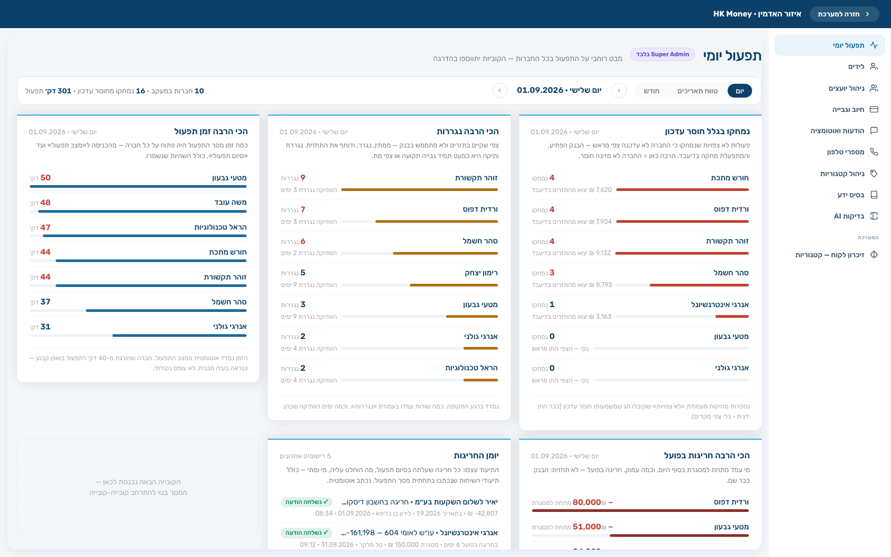

מסך Super-Admin בלבד. לפי יום, טווח או חודש: כמה פעולות לא צפויות נמחקו
מחוסר עדכון · אילו חברות צוברות נגררות · מי לוקח הכי הרבה זמן תפעול ·
הכי הרבה חריגות בפועל · ויומן החריגות עצמו.

---

## 2 · הזיכרון

> יועץ עם 25 לקוחות לא זוכר מה כואב לכל אחד. המערכת זוכרת — ומזכירה לו
> ברגע הנכון: **לפני** הפגישה, לא אחריה.

### 2.1 כרטיס זיכרון הלקוח

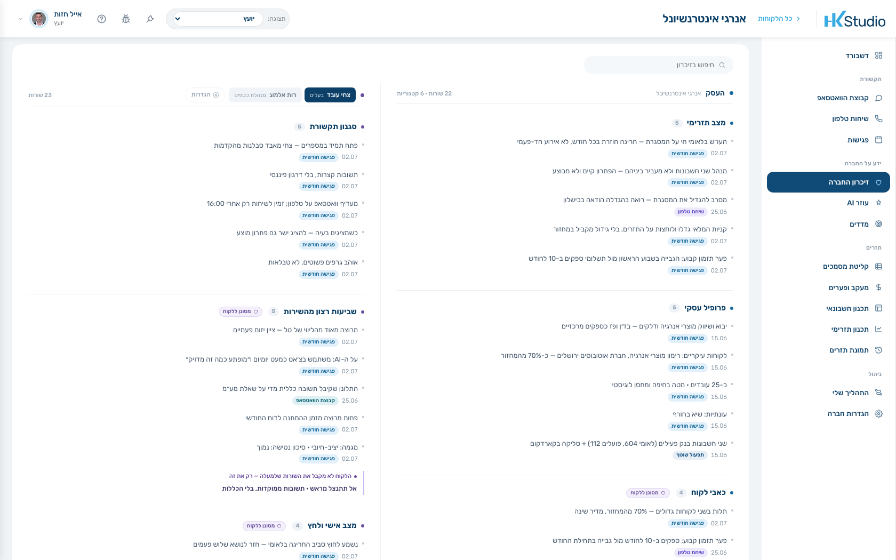

**שתים־עשרה קטגוריות, לכל אחת פרומפט משלה**, המחולקות לשני מעגלים:

| מעגל החברה | מה מוחזק שם | נראה ללקוח |
|---|---|---|
| מצב תזרימי | יתרות, מסגרות, חריגות, פערי תזמון | ✓ |
| פרופיל עסקי | תחומי פעילות, לקוחות וספקים, מבנה | ✓ |
| כאבי לקוח | נקודות הכאב ומגמתן | פנימי |
| יעדים והסכמות | מה סוכם, ומה הסטטוס | ✓ |
| אירועים מהותיים | מה קרה שמשנה את התמונה | ✓ |
| שיתוף פעולה | האם החומר מגיע, ומתי | ✓ |

| המעגל האישי | מה מוחזק שם | נראה ללקוח |
|---|---|---|
| סגנון תקשורת | איך הוא מעדיף לדבר, הנחיות טון | פנימי |
| שביעות רצון מהשירות | מגמה, ולפני שהוא עוזב | פנימי |
| מצב אישי ולחץ | תצפיות בלבד | פנימי |
| הקשר אישי ואמון | מה שבונה את הקשר | פנימי |
| שיתוף פעולה אישי | הגעה ויישום | ✓ |
| משוב ומחמאות לעובד | מה נאמר עליו | ✓ |

**ההפרדה הזו היא הפיצ'ר:** הצ'אט של הלקוח מכוונן לפי הזיכרון האישי שלו,
בלי לחשוף לו את מה שנכתב עליו. `js/memory.js · MEM_CATS`

### 2.2 איך הזיכרון נבנה — מסך שקיפות

לכל קטגוריה מוצג הפרומפט המלא שמתחזק אותה, מתי היא רצה לאחרונה, ומה
נכנס אליה. היועץ תמיד יודע בדיוק מה המערכת יודעת ומאיפה.

### 2.3 הגדרות פר משתמש

אפשר לכבות קטגוריה למשתמש מסוים. מה שלא רלוונטי לא נאסף.

---

## 3 · התקשורת

> השאלה שהיועץ שואל היא "מה קורה עם הלקוח הזה" — לא "אילו פגישות היו".
> תשובה לשאלה הזו חייבת להיות במקום אחד.

### 3.1 מסך אחד, ארבעה ערוצים

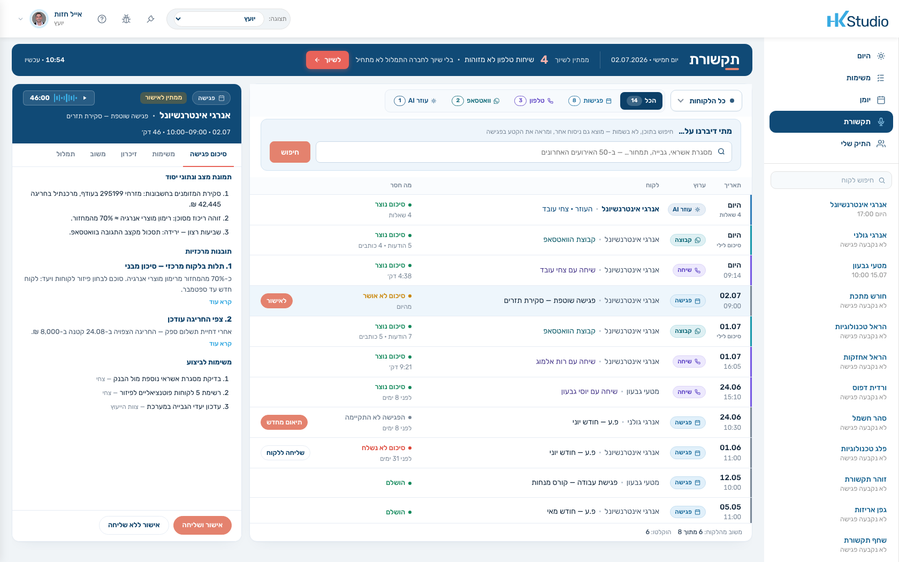

| ערוץ | תוצרים | מזהה במבט |
|---|---|---|
| פגישה | סיכום · משימות · זיכרון · משוב · תמלול | צ׳יפ פחם |
| שיחת טלפון | סיכום · משימות · זיכרון · תמלול | צ׳יפ סגול |
| קבוצת וואטסאפ | סיכום לילי · החלטת זיכרון · ההודעות | צ׳יפ טורקיז |
| עוזר AI | סיכום ההתכתבות · משימות · זיכרון · ההתכתבות | צ׳יפ נייבי |

**בורר הלקוח הוא הבקרה הראשית:** סינון לקוח מציג עליו את הכל. זו הסיבה
שהמסך אחד ולא ארבעה.

### 3.2 קבוצת הוואטסאפ → זיכרון

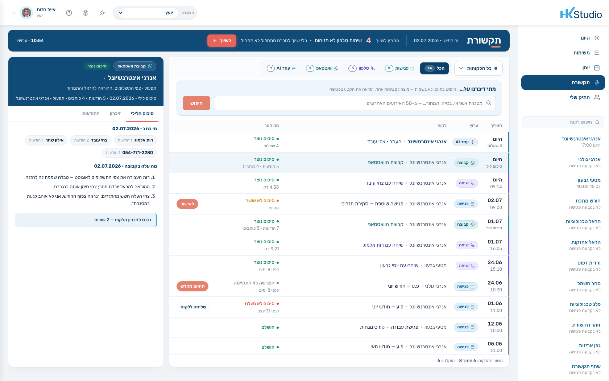

לקבוצה אין התחלה וסוף — יש לה **יום** — ואין לה את תוצרי הפגישה.
המשימות שבתוכה כבר טופלו בזמן אמת: כל הודעה שדורשת פעולה תויגה בשעתה
(«משימת הזנה» · «נגררת» · «בקשה פתוחה») ונכנסה לתפעול. לכן הג׳וב הלילי
סוגר את היום בשני תוצרים בלבד — **מה עלה, ומה נכנס לזיכרון** — ואם לא
נכנס כלום, גם זה נאמר במפורש.

**אותו סיכום מוצג בשני מקומות:** בתוך הקבוצה עצמה, כשורה בין יום ליום,
ובמסך התקשורת. מה שמייחד קבוצה משיחה הוא *מי כתב* — וזה מה שמאפשר
לזהות ש"צחי חוזר על אותה שאלה כשאין לו אישור בכתב". דובר לא מזוהה
מסוכם ברמת החברה בלבד ולא נכנס לזיכרון אישי.

### 3.3 שיחות טלפון — כולל מה שלא זוהה

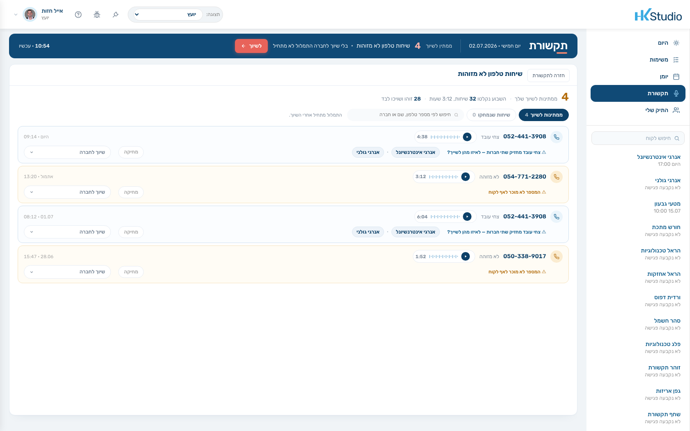

כל שיחה מוקלטת ומתומללת והופכת לזיכרון, כמו פגישה. **שיחה שלא שויכה
לחברה אינה מתומללת** — אין למי לייחס אותה — ולכן היא ממתינה בתור,
והרצועה העליונה סופרת כמה. כשהמספר מוכר והלקוח מחזיק כמה חברות, כל
שורה בבורר היא «שם הלקוח — חברה».

### 3.4 ההתכתבות עם העוזר

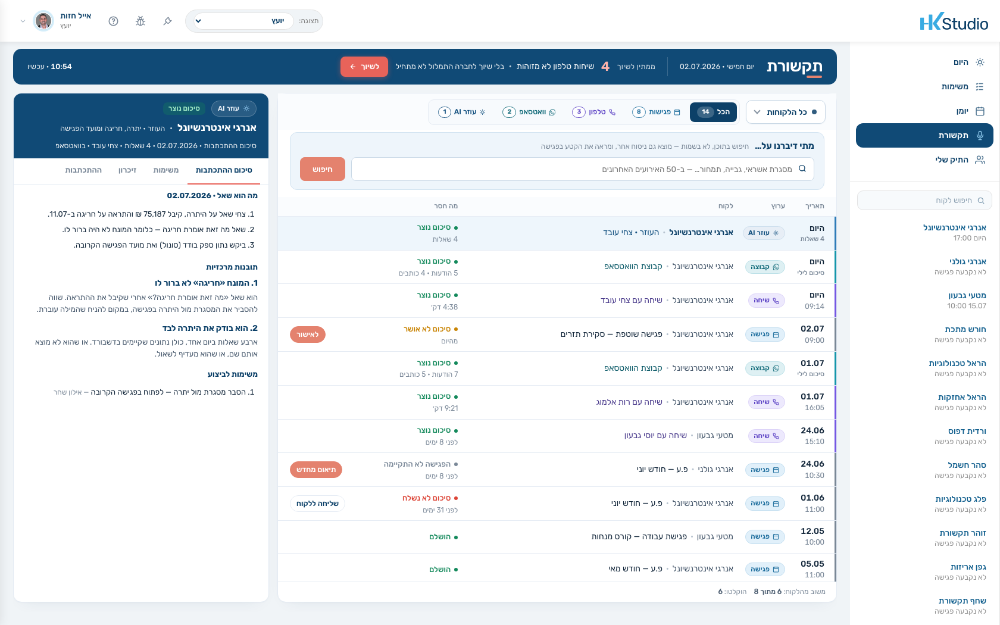

הערוץ היחיד שבו הלקוח מדבר עם המערכת ולא עם אדם — ומה שהוא שואל מגלה
מה מטריד אותו. דוגמה מהמערכת: אחרי התראת חריגה הוא שאל *"מה זאת אומרת
חריגה?"* — וזה הפך למשימה ליועץ ולשורת זיכרון. זה שווה יותר מכל מדד
שימוש.

### 3.5 הג'וב הלילי

בלילה (02:00): סיכום הקבוצות שהיו פעילות · סיכום ההתכתבות פר משתמש ·
מעבר הזיכרון על כל סיכומי היום · השלמת מה שנפל · embeddings לחיפוש
סמנטי · פרסום. בבוקר, בסיום רענון הבנקים: תקציר הבוקר.
מפרט מלא: `docs/NIGHTLY_COMM_SPEC.md`

### 3.6 הפגישה — הכנה, הקלטה, תוצרים

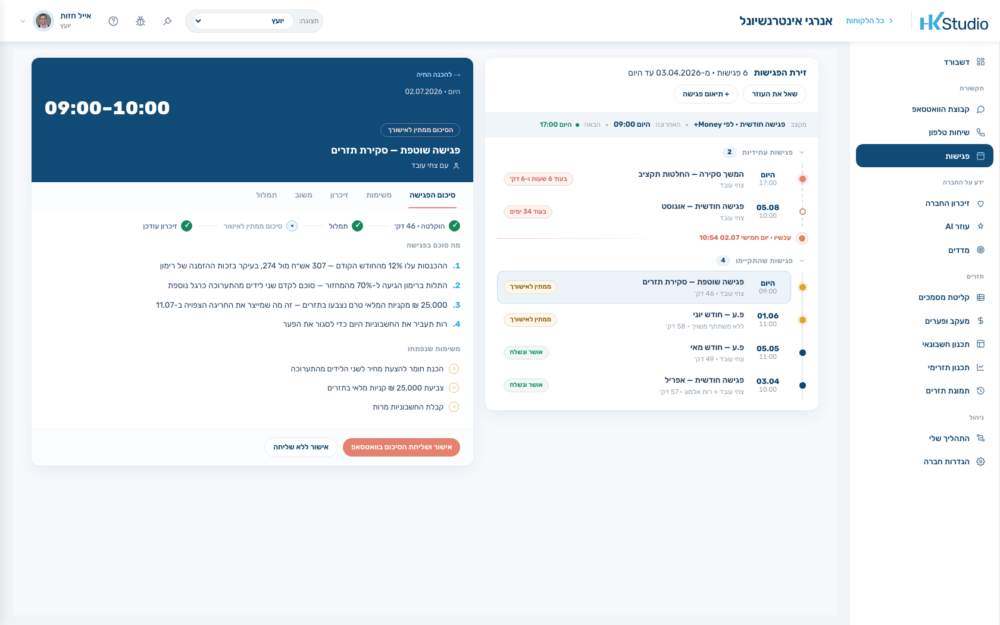

- **ההכנה נגזרת ולא נכתבת** — נבנית מחדש בכל פתיחה מהזיכרון החי,
  מהמספרים העדכניים ומהמשימות הפתוחות. כולל הנחיות אישיות
  ("פתח במספרים — צחי מאבד סבלנות מהקדמות").
- **בר טרום־פגישה** — חמש דקות לפני, המערכת באה ליועץ: הצטרפות לזום,
  התחלת הקלטה, או "הפגישה לא תתקיים" שמסמן ומתזמן מחדש.
- **הקלטה שהיא בר צף ולא מסך** — היועץ ממשיך להראות ללקוח את הדשבורד
  והתזרים תוך כדי, עם כפתור "⚑ רגע חשוב" שמסמן לסיכום.
- **אחרי הפגישה:** תמלול עם נגן, טיוטת סיכום, משימות שה-AI חילץ לאישור,
  ועדכוני זיכרון — עם טאב שקיפות שמראה בדיוק מה נכנס לכרטיס.

### 3.7 משוב AI ליועץ

**הפיצ'ר שאין לאף מתחרה.** אחרי כל פגישה, המערכת נותנת ליועץ משוב
מקצועי על **ניהול הפגישה שלו**: מיקוד וחיבור ל"למה", הקשבה ומרחב,
עבודת עומק ברובד הסמוי, הובלה והנעה לפעולה. לעיניו בלבד — לעולם לא
נשלח ללקוח. היועץ משתפר מפגישה לפגישה.

---

## 4 · המספרים

### 4.1 תכנון תזרימי

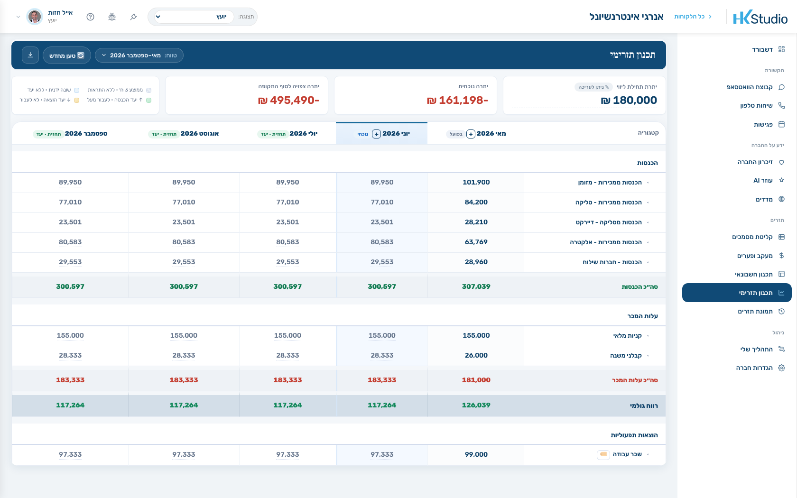

חודשים קדימה לפי קטגוריות — בפועל · נוכחי · תחזית מול יעד — עם יתרה
נוכחית ויתרה צפויה לסוף התקופה. עריכת תא קובעת יעד ללקוח, והיתרות
מתגלגלות קדימה. דריל־דאון בהכנסות מפריד בין *ידוע ומחויב בתזרים* לבין
*נותר פתוח לגבייה* — הלקוח רואה כמה מהתחזית כבר סגורה.

### 4.2 תכנון חשבונאי — על הכרטסת האמיתית

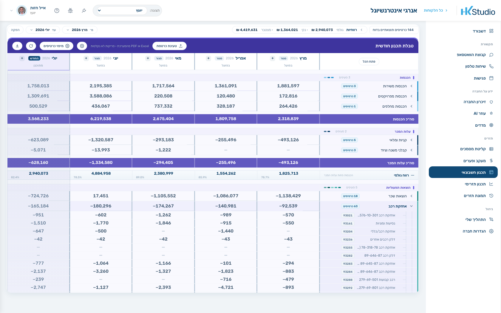

הלקוח מעלה כרטסת מרואה החשבון. בדוגמה שבמערכת: **14,083 תנועות → 631
כרטיסים עם תנועה**, מתוכם 144 תוצאתיים. הכרטיסים נפרשים לדוח רווח
והפסד, ובסדנת המיפוי אפשר להעביר כרטיס מסעיף לסעיף או לתת־סעיף.

**החלוקה שמונעת טעויות:** ה-AI ממפה מבנה ומסווג שמות; **כל חיבור של
סכומים רץ בקוד דטרמיניסטי** עם בדיקות ביקורת. וכרטיס שייך לסעיף אחד
בדיוק — לכן סה"כ הדוח נשמר בכל פירוק. PDF סרוק נדחה בשער.
מפרט מלא: `docs/ACCOUNTING_PLAN_SPEC.md`

### 4.3 תמונת תזרים

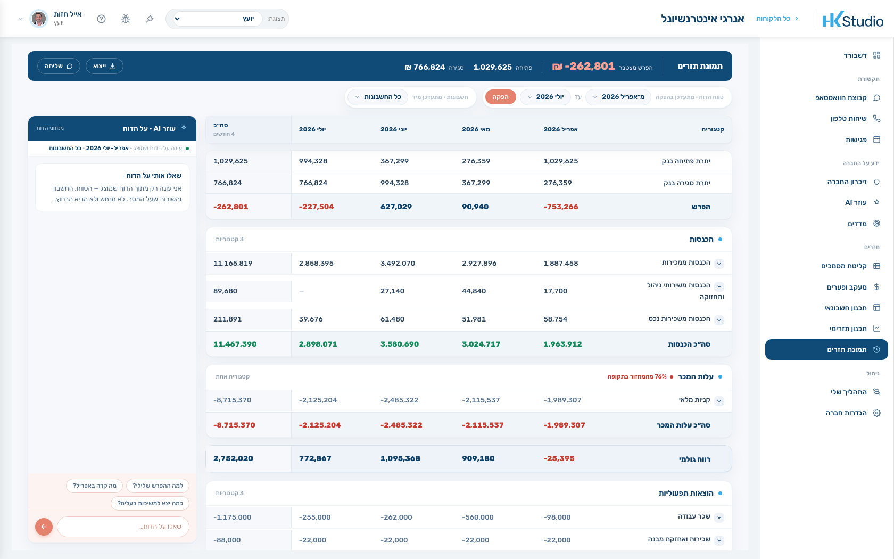

מה באמת קרה: דוח חודשי מקובץ להכנסות, עלות המכר, הוצאות ומימון, עם
רצועות רווח בין הקבוצות ודריל־דאון עד לתנועות עצמן. זה הדוח שסוגר
ויכוחים — הכל ירד מהבנק, שקל בשקל.

### 4.4 מעקב ופערים

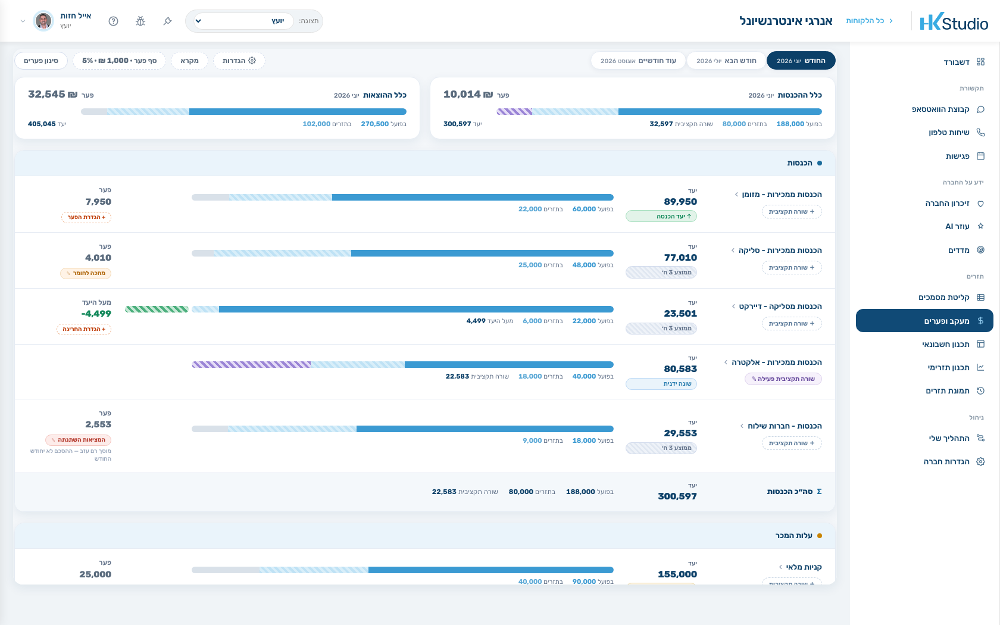

בקרה חיה על החודש: לכל שורה יעד (ממוצע, ידני, או יעד מהתחזית — עם תגי
מקור), ובר התקדמות שמפריד בין מה שירד בפועל למה שכבר **צבוע** בתזרים
קדימה. הפער מסומן כ"נותר לצביעה בתזרים" — כך רואים חריגה מתהווה לפני
שהיא קורית.

### 4.5 קליטת מסמכים + תנאי תשלום לפי ספק

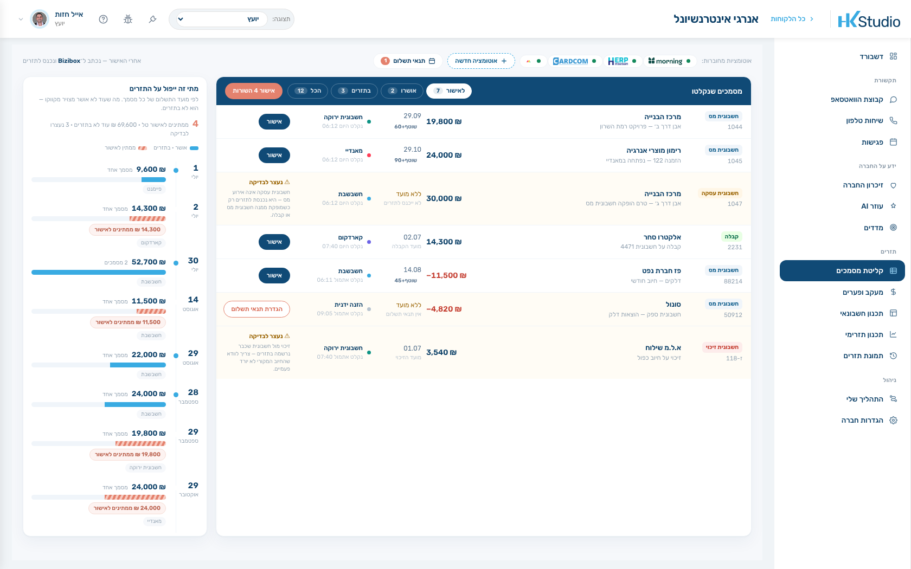

כל מסמך שנקלט (חשבונית, שיק, אישור העברה) נכנס לתזרים. **לכל ספק ולקוח
תנאי תשלום משלו** — כשחשבונית נקלטת, המועד שלה בתזרים נגזר מהתנאי ולא
מתאריך המסמך. זה מה שהופך מסך קליטה למסך תזרים.

### 4.6 מדדים

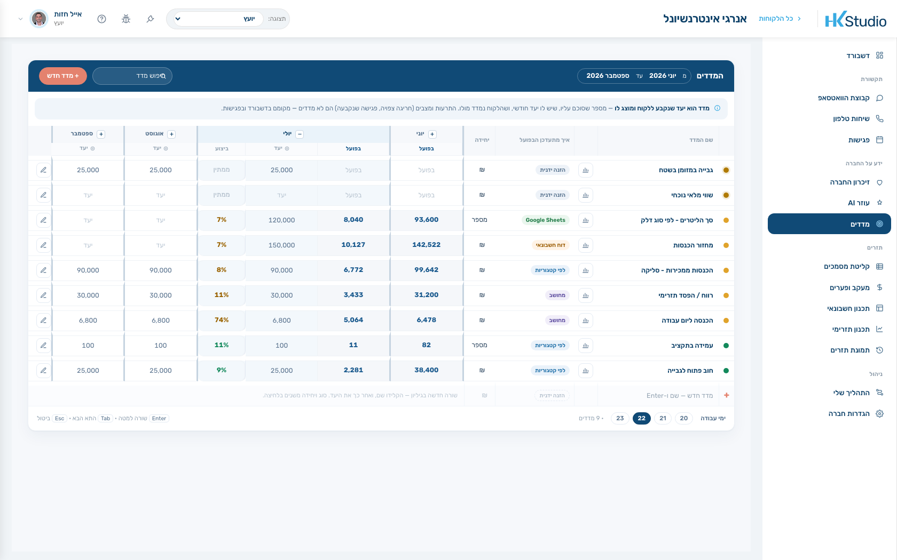

מעבר לכסף: הזנה ידנית · משיכה אוטומטית מגוגל־שיט של הלקוח · קטגוריות
ביזיבוקס · ומדדים מחושבים בנוסחה בין כל שני מקורות. כל מדד עם יעד,
מגמה והתראות — לוח מחוונים עסקי, לא רק פיננסי.

---

## 5 · מה הלקוח מקבל

> הלקוח מקבל מערכת. היועץ מקבל את הקרדיט. **הלקוח לא רואה "HK" בשום
> מקום** — לא בכותרת, לא בשם הבוט, ולא בתפקידים.

### 5.1 הדשבורד ותקציר הבוקר

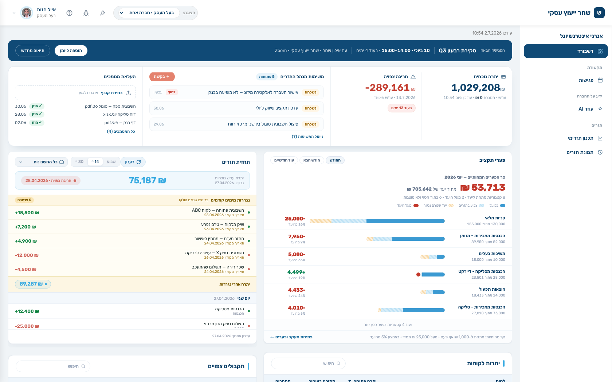

**תקציר הבוקר** הוא הפיצ'ר שהלקוח פוגש ראשון: פסקה אחת שנכתבת כל בוקר
מ**כל הזיכרון** של החברה + מספרי הבנק הטריים — *"היתרה עומדת על 75,187 ₪,
וצפויה חריגה ב-11.07 אם ההעברה מפועלים 112 ללאומי 604 לא תבוצע…"* —
עם קישורים לראיות בווידג'טים. אם רענון הבנקים נכשל, התקציר נכתב מהזיכרון
עם מספרי אתמול מסומנים — לא ממתין ולא נעלם.

מתחת: פס קבוע עם יתרה נוכחית, חריגה צפויה, משימות פתוחות והעלאת מסמכים.

### 5.2 העוזר בוואטסאפ

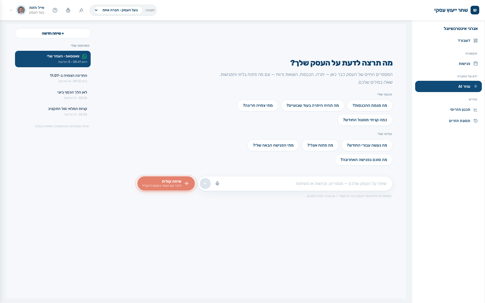

הלקוח שואל במילים שלו — "מה היתרה עכשיו?", "כמה קניתי מסונול החודש?" —
והמספרים החיים של העסק כבר בהקשר. אותו ערוץ נושא גם את הודעות התפעול
והתזכורות.

### 5.3 מה עוד הוא רואה

הפגישות שלו (רק מה שאושר — הסיכום והמשימות) · קבוצת הוואטסאפ · שיחות
הטלפון · תכנון תזרימי **לקריאה בלבד** · תמונת תזרים · קליטת מסמכים ·
מדדים · והתהליך שלו.

---

## 6 · הניהול

### 6.1 התיק שלי

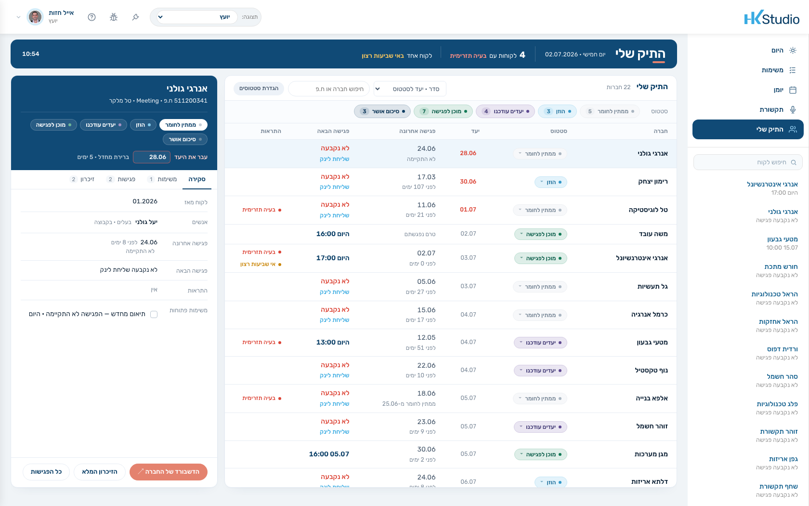

כל התיק במבט אחד: כרטיס לכל לקוח עם פס דופק, יתרה ומגמה, גרף הכנסות
מיניאטורי, וההתראה החשובה מכולן — "לא הביא חומר לתזרים X ימים".

### 6.2 היום והמשימות

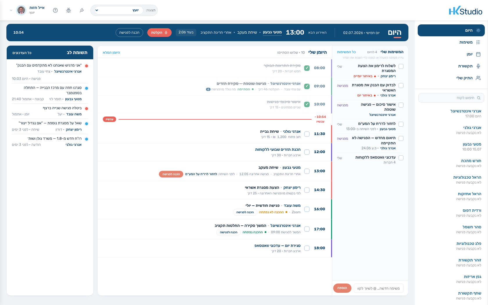 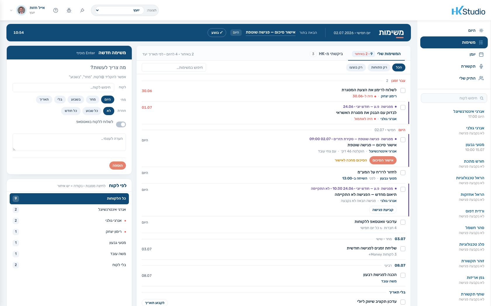

היומן על ציר עם מה שנולד מכל פגישה, המשימות להיום ומה שעבר זמנו, ותשומת
לב מהזיכרון. במשימות: הוספה בשפה חופשית (@לקוח, "מחר"), משימות חוזרות,
שליחת משימה ללקוח בוואטסאפ, והפרדה מלאה בין המשימות שלו לבין **בקשות
מ-HK** — מה שהוא ביקש ממנהל התזרים, עם מצב ויעד. גרירה משנה סדר.

### 6.3 הגדרות חברה

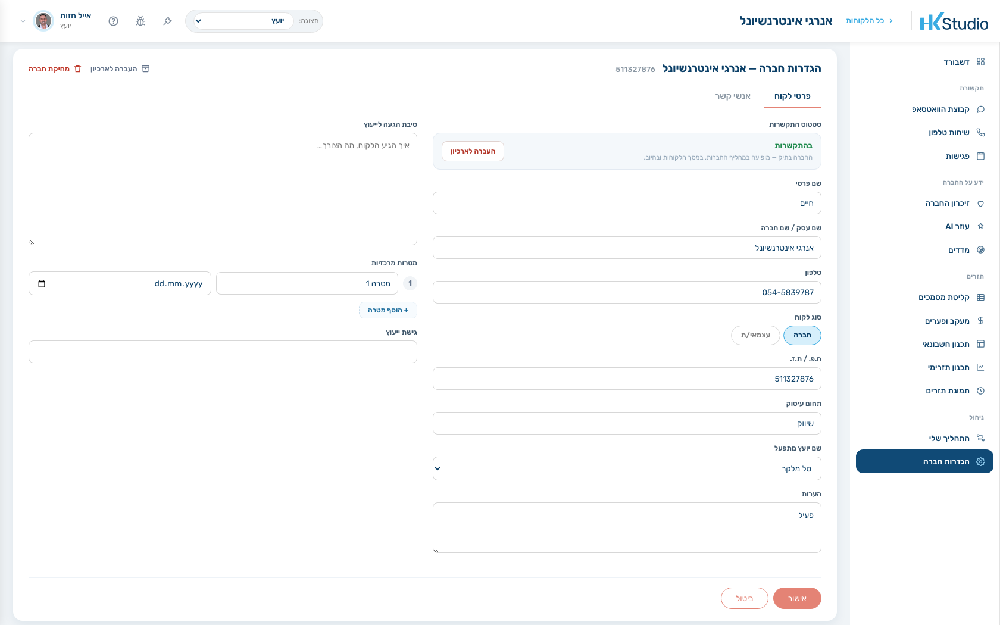

פרטי לקוח · אנשי קשר עם 11 סוגי הודעות אוטומטיות לבחירה · תפעולי ·
פיננסים · וטאב זיכרון מלא עם שורת שקיפות שמסבירה מה נשלח לצ'אט ומה לא.

### 6.4 אזור הניהול

| מסך | מה הוא עושה |
|---|---|
| 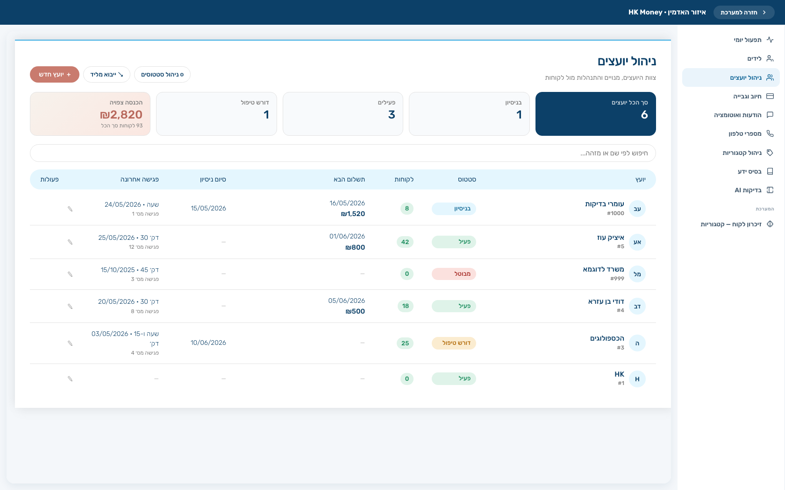 ניהול יועצים | משרדים, יועצים, הרשאות |
| 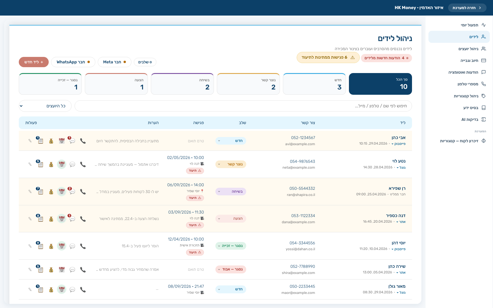 לידים | צינור הגיוס |
| 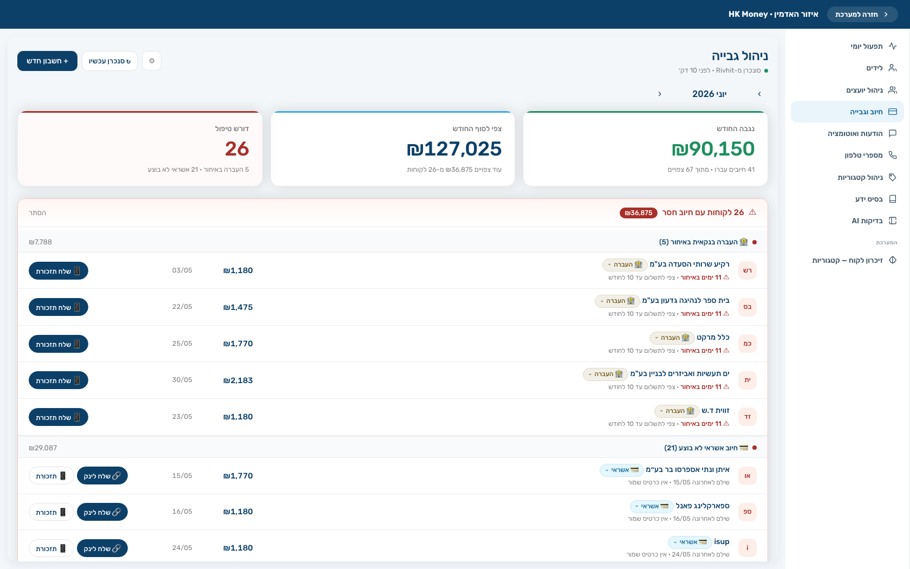 חיוב וגבייה | מי משלם כמה ומתי |
| 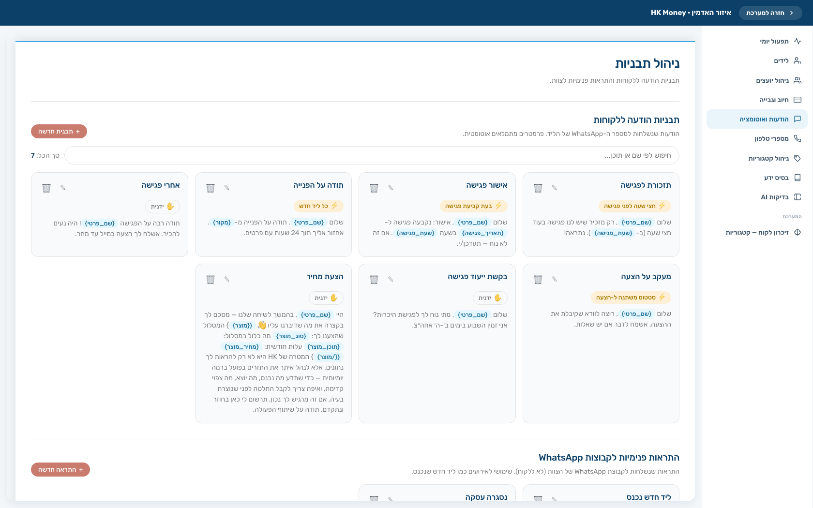 הודעות ואוטומציה | תבניות וואטסאפ מאושרות |
| 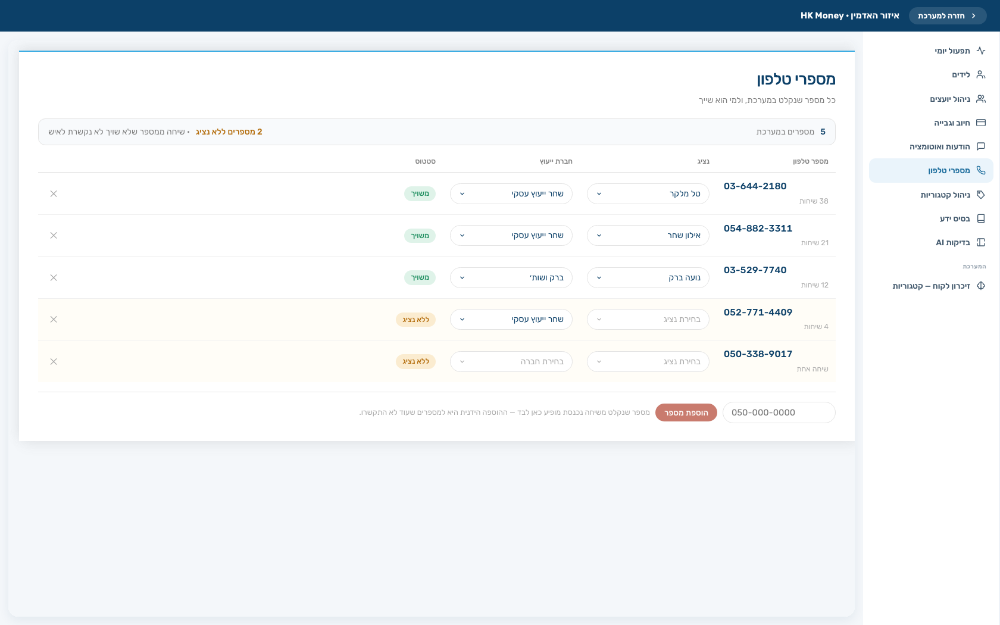 מספרי טלפון | מספר → נציג → חברת ייעוץ. זה מה שמאפשר לשיחה נכנסת להתחבר ללקוח |
| 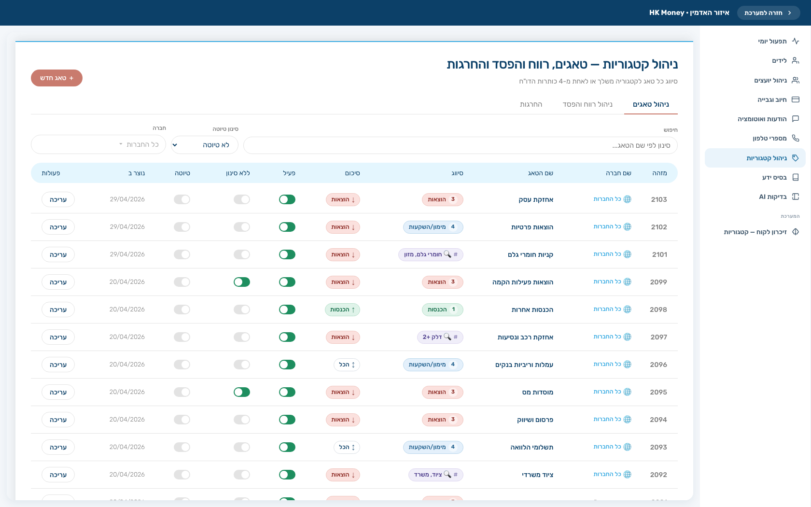 ניהול קטגוריות | הקטגוריות שהתפעול מקטלג לפיהן |
| 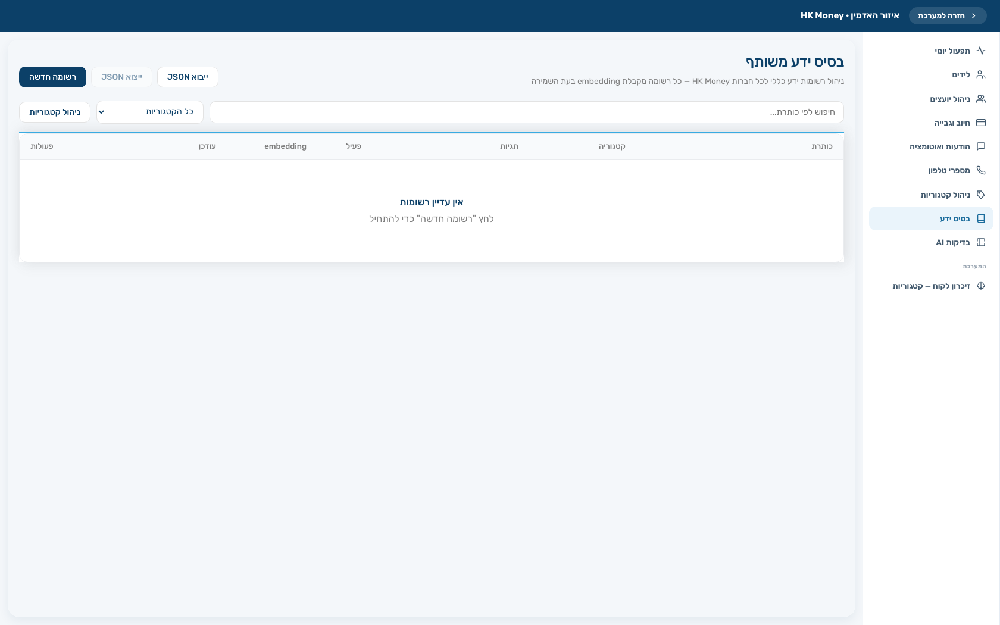 בסיס ידע | מה שה-AI יודע על התחום |
| 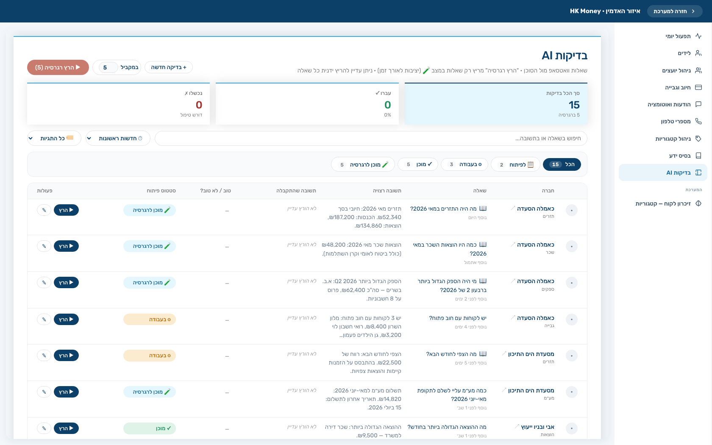 בדיקות AI | בקרת איכות על התוצרים |
| 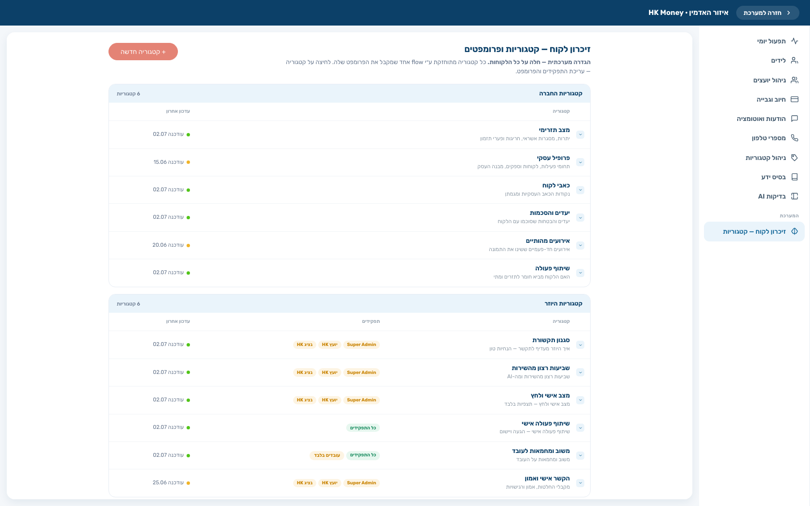 קטגוריות זיכרון | הפרומפטים עצמם, ברמת המערכת |

---

## 7 · עזרה בכל מסך

אייקון **?** אחד בפס העליון. הוא יודע באיזה מסך אתה עומד ופותח את
ההסבר שלו — למה המסך בנוי ככה ומה הוא חוסך — עם צילומי מסך. לבעל העסק
נפתחת גרסה משלו, בלי שום מונח פנימי. `js/help.js` · `js/help-content.js`

---

*כל הצילומים נוצרים מהפרוטוטיפ החי ב-`./qa/shots.sh docs/shots`.
מסמכי אפיון: `NIGHTLY_COMM_SPEC.md` · `ACCOUNTING_PLAN_SPEC.md` ·
`MEMORY_SPEC.md` · `CLIENT_SCREENS_SPEC.md`.*
