# HK ליועצים — כל הפיצ'רים

*מסמך מרוכז לדף הנחיתה · נבנה מהפרוטוטייפ החי · אוגוסט 2026*

**הסיפור בשורה אחת:** HK נותנת ליועץ העסקי מערכת שהוא לא היה חולם לבנות לבד — דשבורד ודוחות תזרים ברמת CFO לכל לקוח, פגישות שמקליטות את עצמן והופכות לזיכרון, הכנה שנכתבת לבד, ותפעול תזרים שמישהו אחר עושה בשבילו. היועץ עושה את מה שהוא הכי טוב בו: לייעץ. את כל השאר עושה המערכת.

---

## תוכן עניינים

**הבוקר של היועץ**
1. [דשבורד הבוקר של היועץ](#1-דשבורד-הבוקר-של-היועץ)
2. [רדאר שימור והרחבה](#2-רדאר-שימור-והרחבה)
3. [היומן החכם — עם הכנה בפנים](#3-היומן-החכם)
4. [הפיד המאוחד — מהמספרים ומהזיכרון](#4-הפיד-המאוחד)

**הלקוחות והזיכרון**

5. [זירת הלקוחות](#5-זירת-הלקוחות)
6. [כרטיס זיכרון הלקוח](#6-כרטיס-זיכרון-הלקוח)

**המספרים — מה היועץ והלקוח מקבלים**

7. [דשבורד החברה — לוח ווידג'טים](#7-דשבורד-החברה)
8. [דו"ח תזרים עתידי](#8-דוח-תזרים-עתידי)
9. [תזרים עבר](#9-תזרים-עבר)
10. [תקציב תזרימי](#10-תקציב-תזרימי)
11. [מדדים](#11-מדדים)

**הפגישות — הליבה**

12. [זירת הפגישות](#12-זירת-הפגישות)
13. [שיחות מהסים של HK](#13-שיחות-מהסים-של-hk)
14. [מסך הפגישות של הלקוח](#14-מסך-הפגישות-של-הלקוח)
15. [קביעת פגישה](#15-קביעת-פגישה)
16. [בר טרום-פגישה — אפס פספוסים](#16-בר-טרום-פגישה)
17. [הקלטה שלא עוצרת אותך](#17-הקלטה-שלא-עוצרת-אותך)
18. [פגישה שטרם התחילה](#18-פגישה-שטרם-התחילה)
19. [עמוד הפגישה — תמלול, סיכום, משימות](#19-עמוד-הפגישה)
20. [משוב AI ליועץ](#20-משוב-ai-ליועץ)
21. [עדכוני זיכרון מהפגישה](#21-עדכוני-זיכרון-מהפגישה)
22. [הכנה לפגישה — נכתבת לבד](#22-הכנה-לפגישה)

**ניהול**

23. [הגדרות חברה + טאב זיכרון](#23-הגדרות-חברה)

---

## 1. דשבורד הבוקר של היועץ

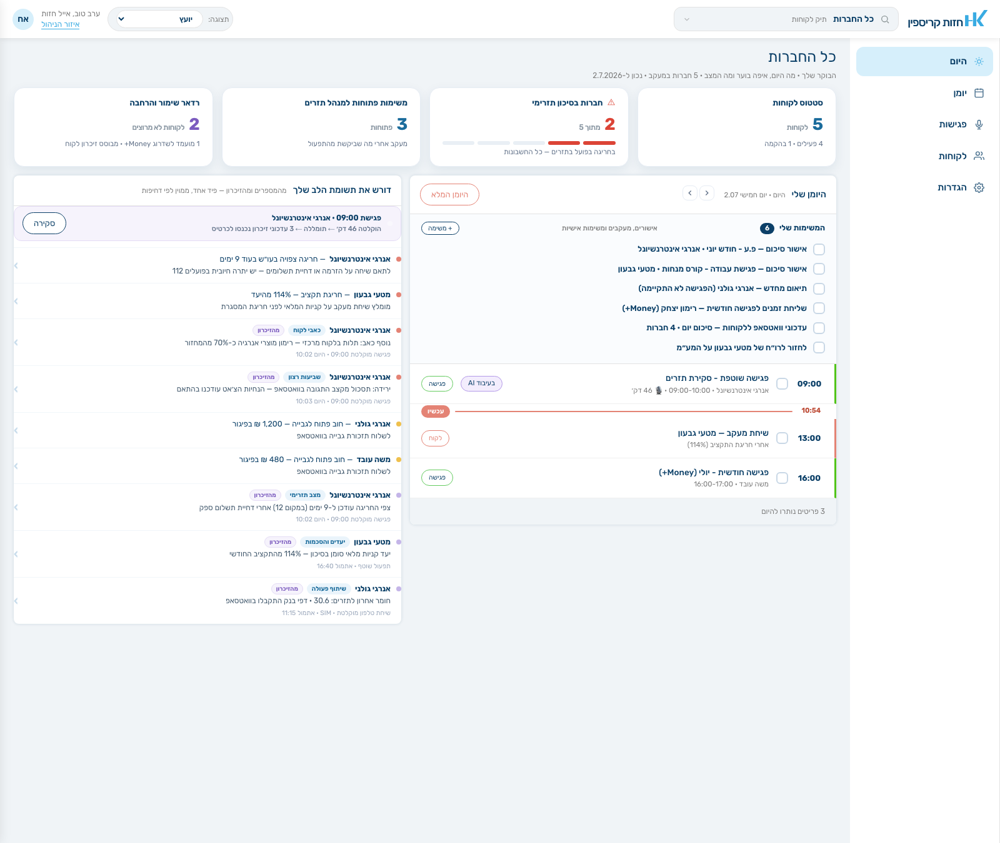

היועץ פותח את הבוקר ורואה את כל העסק שלו במסך אחד: כמה לקוחות פעילים ומה כל אחד משלם, אילו חברות בסיכון תזרימי אמיתי (עם פתרון מוצע בין-חשבונות), אילו משימות פתח למנהל התזרים של HK — ומי מהלקוחות צריך אותו היום. בלי לפתוח אקסלים, בלי להתקשר לאף אחד.

- **קוד:** `js/alerts.js` — `renderAdvisorHome()`, `advTopCards()`, `advPop()`
- **סטטוס:** עובד בפרוטוטייפ

## 2. רדאר שימור והרחבה

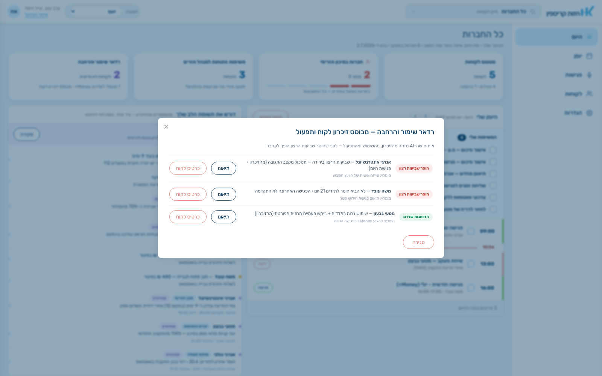

המערכת מזהה לבד — מתוך הזיכרון, השימוש והתפעול — איזה לקוח לא מרוצה לפני שהוא עוזב, ואיזה לקוח בשל לשדרוג. כל אות מגיע עם "למה" ועם המלצת פעולה. היועץ מגלה את הבעיה כשעוד אפשר לתקן אותה.

- **קוד:** `js/alerts.js` — `ADV_RADAR`, `advPop('radar')`
- **סטטוס:** עובד בפרוטוטייפ

## 3. היומן החכם

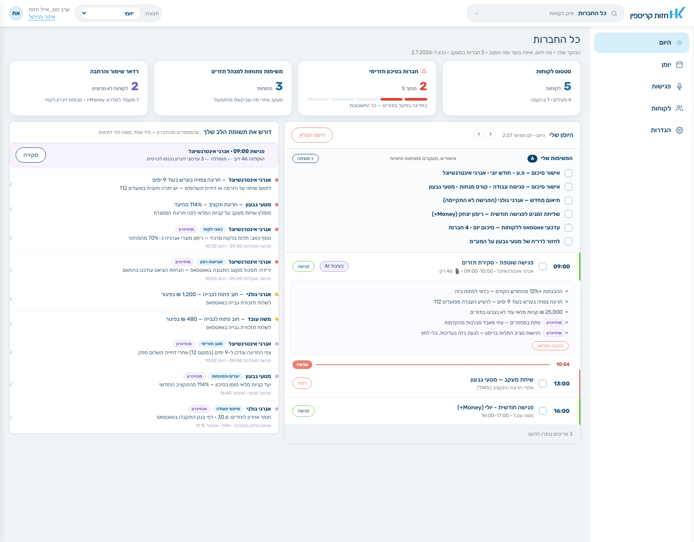

יומן שמכיל רק את מה שחשוב: פגישות ושיחות, עם ניווט בין ימים. ולכל פגישה — ההכנה מחכה בפנים: לחיצה אחת פותחת את נקודות הפתיחה ואת ההנחיות האישיות מהזיכרון ("פתח במספרים — צחי מאבד סבלנות מהקדמות"). המשימות האישיות חיות בפאנל נפרד עם הוספה מהירה.

- **קוד:** `js/alerts.js` — `ADV_PREPS`, `advPrepTg()`, `advDayNav()`, `advTaskNew()`
- **סטטוס:** עובד בפרוטוטייפ

## 4. הפיד המאוחד

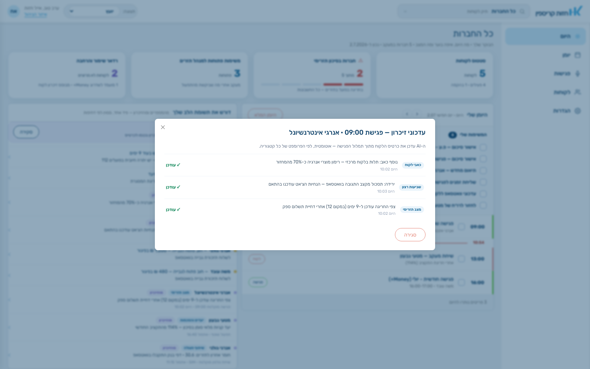

"דורש את תשומת הלב שלך" — פיד אחד שמאחד התראות מהמספרים (חריגה צפויה, חריגת תקציב, חובות) עם עדכונים מהזיכרון (כאב חדש שעלה בפגישה, ירידה בשביעות רצון), ממוין לפי דחיפות. למעלה — צינור הפגישה האחרונה: הוקלטה ← תומללה ← עדכוני הזיכרון שנכנסו לכרטיס, עם סקירה בלחיצה.

- **קוד:** `js/alerts.js` — `FEED`, `advPop('mem')` · `js/memory.js` — `MEM_UPDATES`
- **סטטוס:** עובד בפרוטוטייפ

## 5. זירת הלקוחות

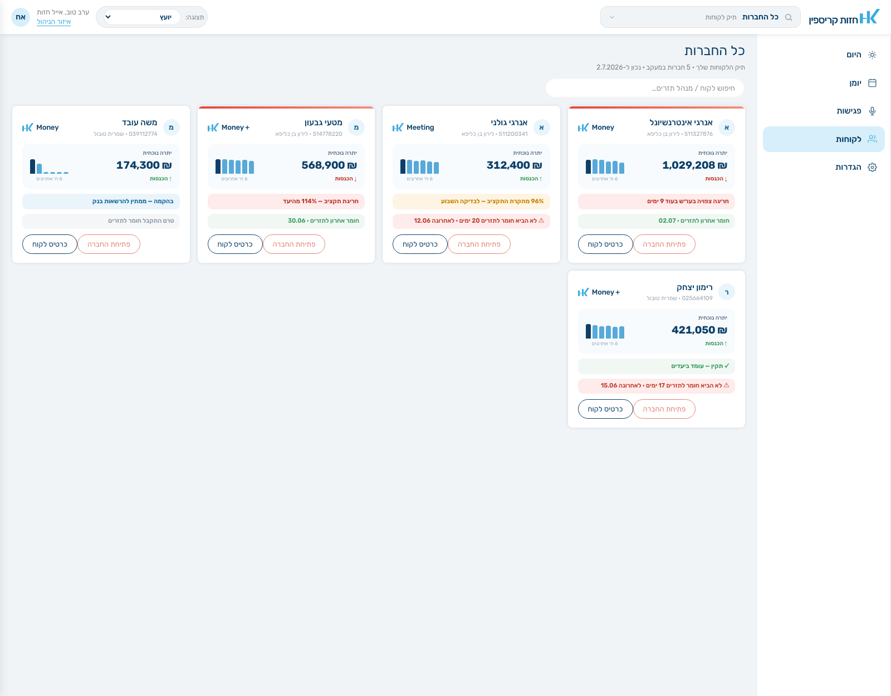

כל התיק במבט אחד: כרטיס לכל לקוח עם פס דופק צבעוני, יתרה ומגמה, גרף הכנסות מיניאטורי, וההתראה החשובה מכולן — "לא הביא חומר לתזרים X ימים". מי שדורש טיפול בולט מיד.

- **קוד:** `js/screens.js` — `renderClientsView()`
- **סטטוס:** עובד בפרוטוטייפ

## 6. כרטיס זיכרון הלקוח

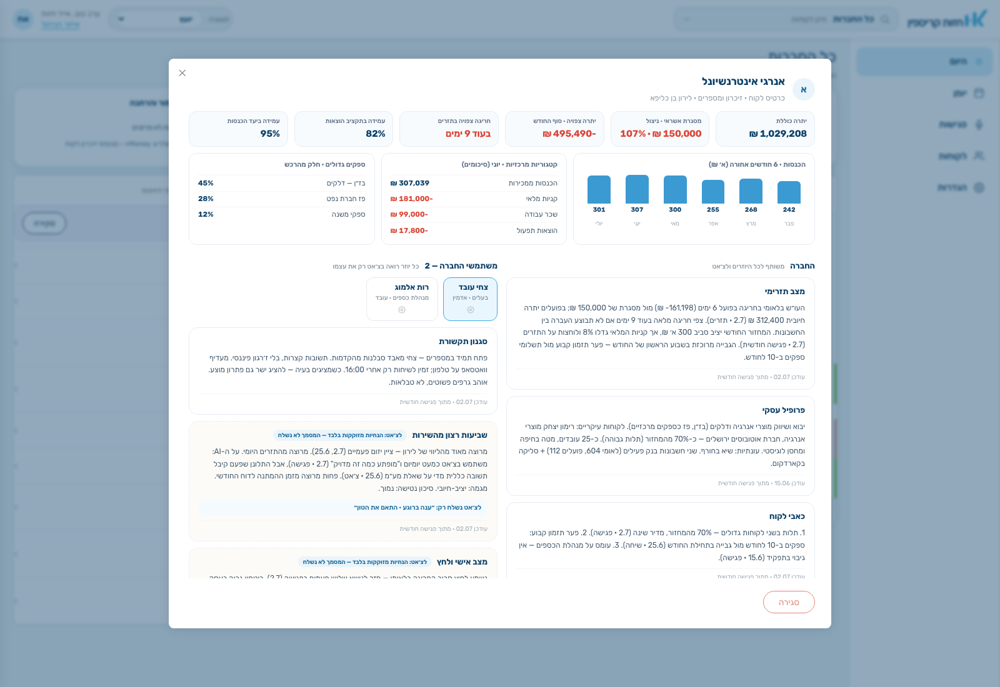

הנשק הסודי של היועץ: המערכת זוכרת הכל על כל לקוח — מצב תזרימי, פרופיל עסקי, כאבים, יעדים והסכמות, אירועים מהותיים ושיתוף פעולה — ומעדכנת את עצמה אחרי כל פגישה, שיחה וצ'אט. כולל זיכרון אישי לכל משתמש בחברה (סגנון תקשורת, מצב אישי) שמכוונן את הצ'אט בלי לחשוף מידע רגיש. אחרי שנה עם HK, לזיכרון הזה אין תחליף בשום מקום.

- **קוד:** `js/memory.js` — `MEM_CATS`, `openMemCard()`, `renderMemCard()`
- **סטטוס:** עובד בפרוטוטייפ

## 7. דשבורד החברה

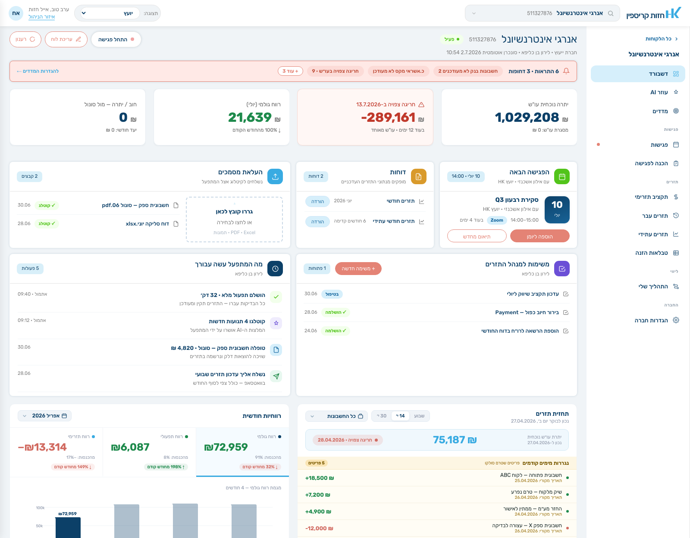

לכל לקוח — דשבורד חי ברמה שחברות גדולות משלמות עליה הון: קוביות KPI (יתרת עו"ש, חריגה צפויה, רווח גולמי, חוב מול ספק), תחזית תזרים יומית עם אינדיקציית סיכון, רווחיות חודשית ומדדים — הכל מתעדכן אוטומטית מהבנקים ומ-Bizibox. היועץ עורך את הלוח ומתאים אותו לכל לקוח: גרירה, הוספת ווידג'טים, חצי/מלא רוחב. זה המסך שהיועץ פותח מול הלקוח בפגישה — והלקוח רואה אותו גם לבד באפליקציה.

- **קוד:** `js/board.js` — `renderBoard()`, `CATALOG`, `BOARDS` · ווידג'טים: `widgets/*.html`
- **סטטוס:** עובד בפרוטוטייפ

## 8. דו"ח תזרים עתידי

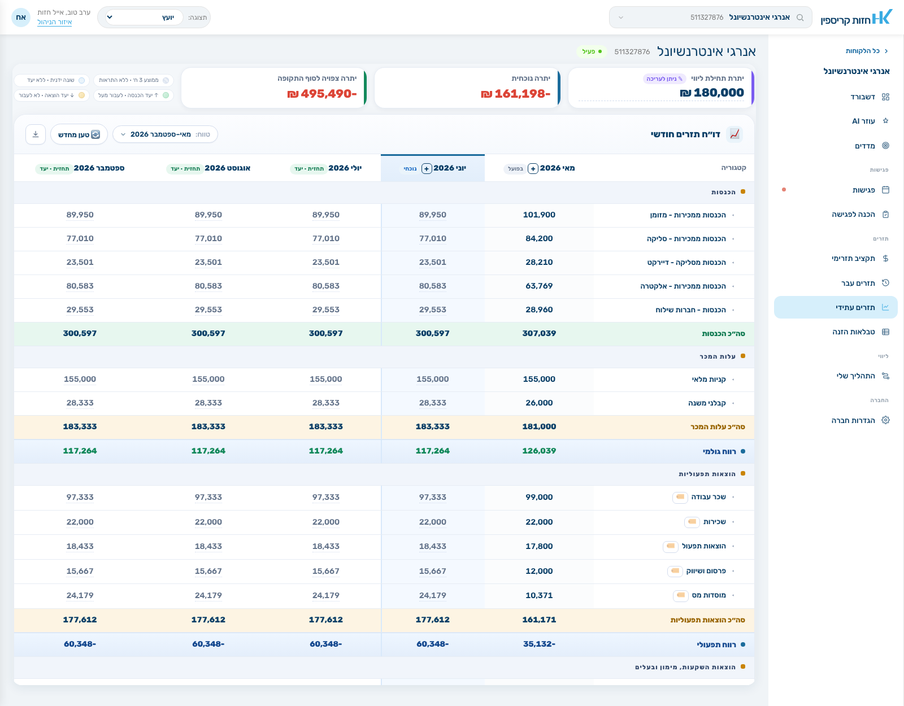

הדוח שסביבו נבנית הפגישה החודשית: חודשים קדימה לפי קטגוריות — בפועל, נוכחי ותחזית מול יעד — עם יתרה נוכחית ויתרה צפויה לסוף התקופה. דריל-דאון בהכנסות מפריד בין "ידוע ומחויב בתזרים" לבין "נותר פתוח לגבייה" — כך שהלקוח רואה בדיוק כמה מהתחזית כבר סגורה וכמה תלויה בגבייה שלו.

- **קוד:** `monthly-goal-index.html` (מוטמע ב-iframe, `showTab('fcast')`)
- **סטטוס:** עובד בפרוטוטייפ

## 9. תזרים עבר

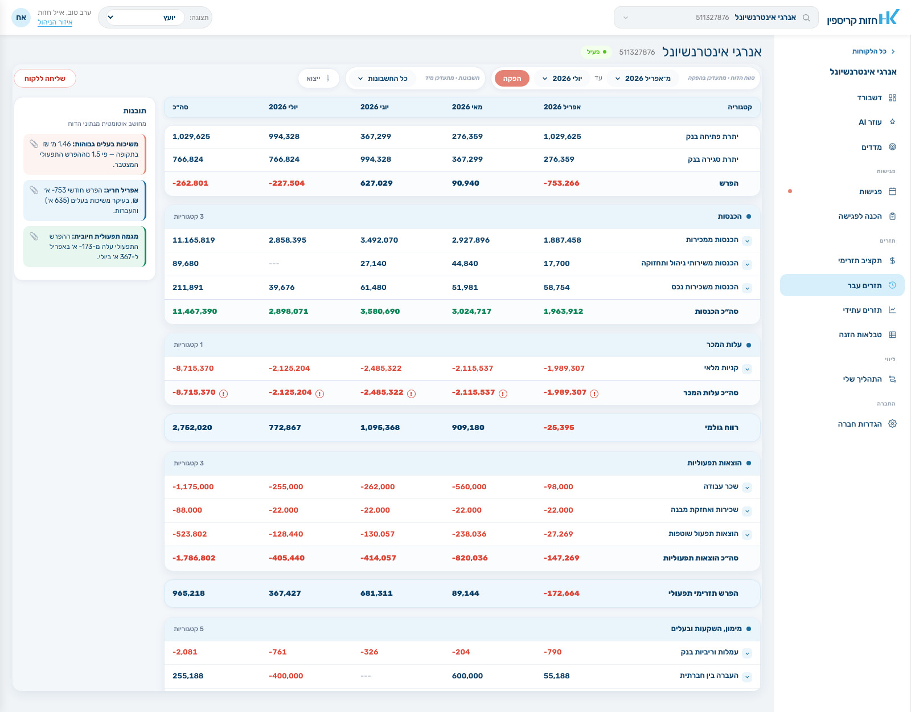

מה באמת קרה: דוח חודשי מקובץ לפי הכנסות, עלות המכר, הוצאות ומימון — עם רצועות רווח בין הקבוצות, דריל-דאון מקטגוריה לגורמים ועד לתנועות עצמן, ואחוז מהמחזור על כל סעיף. בחירת טווח והפקה מחדש, וסינון לפי חשבונות. זה הדוח שסוגר ויכוחים — הכל ירד מהבנק, שקל בשקל.

- **קוד:** `past-cashflow.html` (מוטמע ב-iframe, `showTab('past')`)
- **סטטוס:** עובד בפרוטוטייפ

## 10. תקציב תזרימי

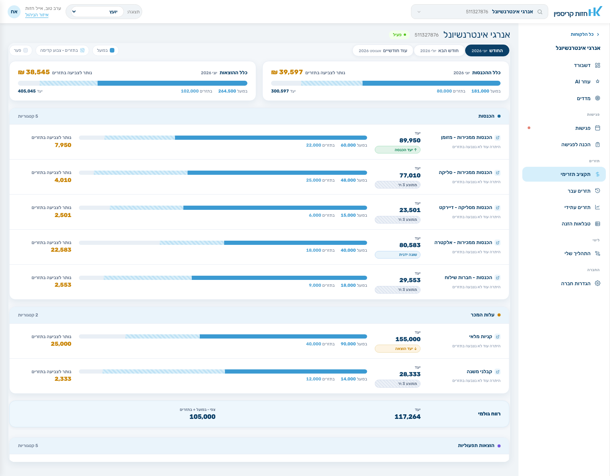

בקרה חיה על החודש: לכל שורה יעד (ממוצע, ידני או יעד מהתחזית — עם תגי מקור), בר התקדמות שמפריד בין מה שירד בפועל למה שכבר "צבוע" בתזרים קדימה, והפער מסומן — "נותר לצביעה בתזרים". שורות רווחיות בין הקבוצות, ופופאפ תנועות לכל שורה. היועץ רואה חריגה מתהווה לפני שהיא קורית.

- **קוד:** `budget-flow.html` (מוטמע ב-iframe, `showTab('budget')`)
- **סטטוס:** עובד בפרוטוטייפ

## 11. מדדים

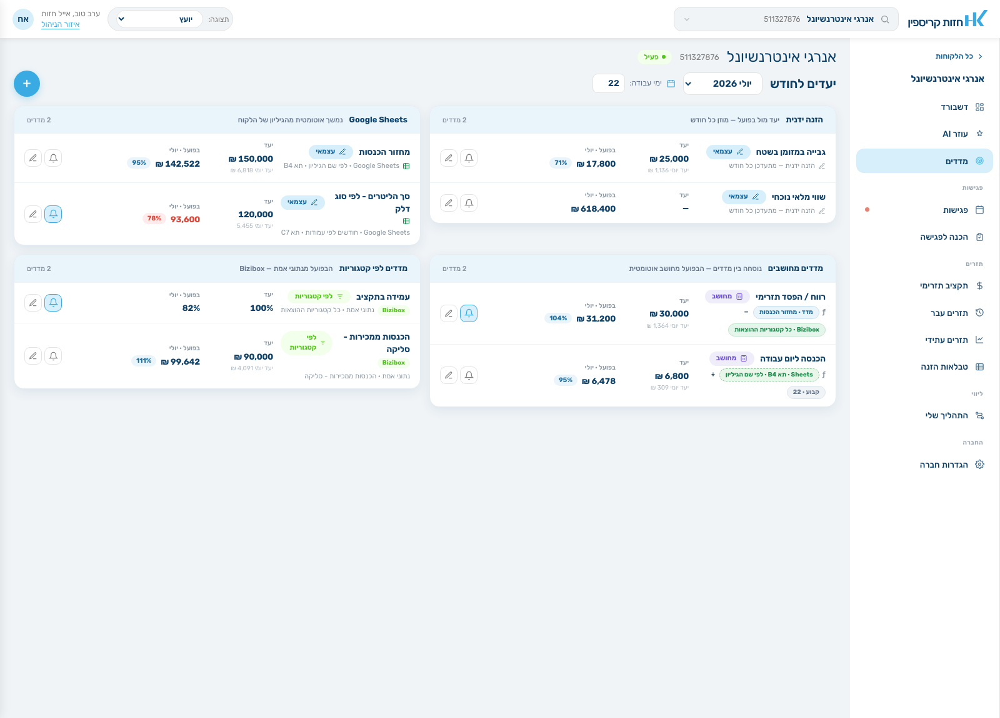

מעבר לכסף — המספרים שמנהלים את העסק: מדדים בהזנה ידנית, מדדים שנמשכים אוטומטית מגוגל שיט של הלקוח, מדדים לפי קטגוריות ביזיבוקס, ומדדים מחושבים — נוסחה בין כל שני מקורות (מדד, קטגוריה, תא מגיליון עם לוגיקה, או קבוע). כל מדד עם יעד, מגמה והתראות. היועץ בונה ללקוח לוח מחוונים עסקי אמיתי, לא רק פיננסי.

- **קוד:** `js/screens.js` — `renderMetrics()`, `MGROUPS`, `MX_OPS`
- **סטטוס:** עובד בפרוטוטייפ

## 12. זירת הפגישות

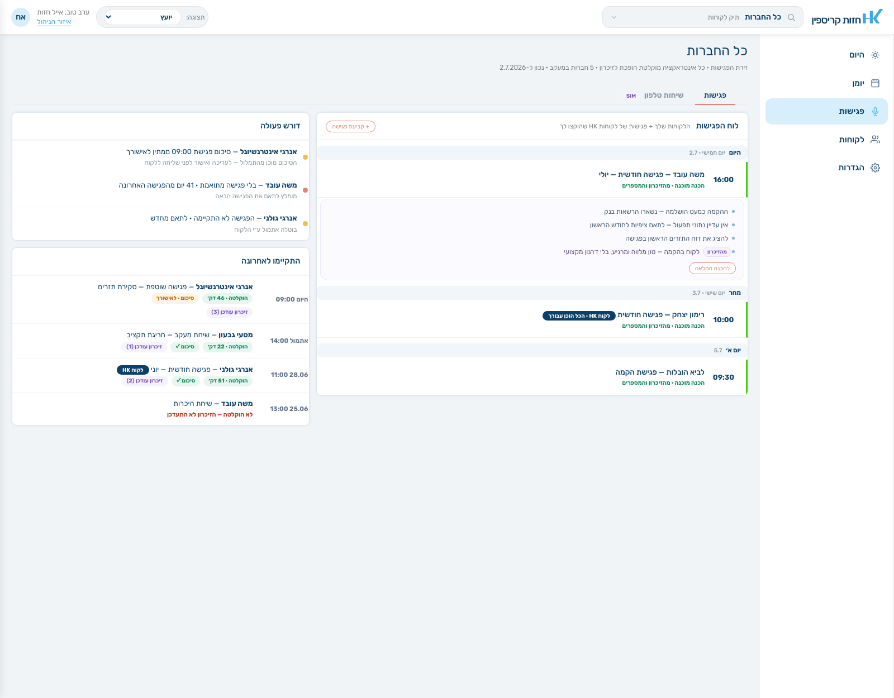

מסך אחד שמבטיח שאף פגישה לא מתפספסת: לוח הפגישות הקרובות עם הכנה מוכנה לכל אחת (כולל פגישות של לקוחות HK שהוקצו ליועץ — "הכל הוכן עבורך"), "דורש פעולה" עם סיכומים לאישור ולקוחות בלי תיאום, ו"התקיימו לאחרונה" עם צינור העיבוד המלא — כולל דגל אדום על פגישה שלא הוקלטה, כי פגישה בלי הקלטה היא חור בזיכרון.

- **קוד:** `js/meetings.js` — `renderMeetsArena()`, `MEETS_UP`, `MEETS_PAST`
- **סטטוס:** עובד בפרוטוטייפ

## 13. שיחות מהסים של HK

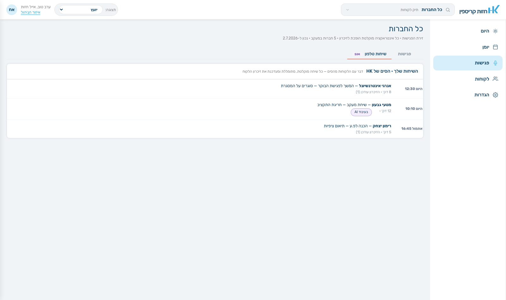

היועץ מקבל מ-HK סים ייעודי לשיחות עם לקוחות — וכל שיחה מוקלטת, מתומללת ומעדכנת את זיכרון הלקוח, בדיוק כמו פגישה. השיחות שבין הפגישות מפסיקות ללכת לאיבוד.

- **קוד:** `js/meetings.js` — `MEETS_CALLS_ADV`, טאב `call` ב-`renderMeetsArena()`
- **סטטוס:** ממשק עובד בפרוטוטייפ · הסים — פריסה בהמשך

## 14. מסך הפגישות של הלקוח

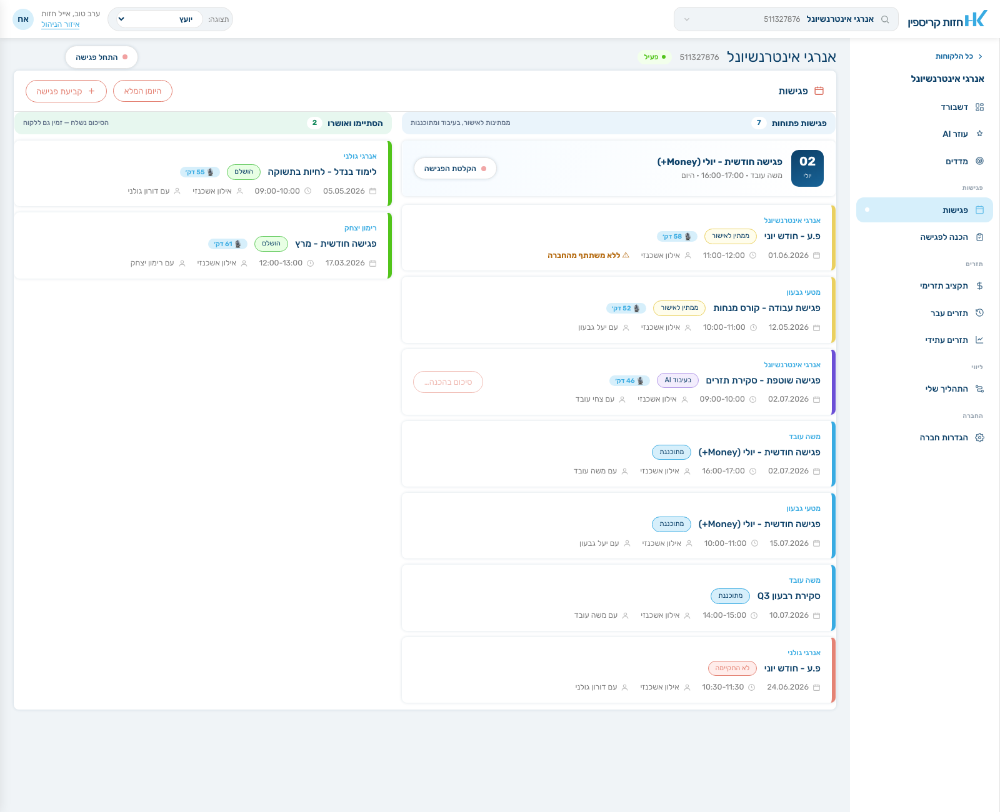

בתוך כל חברה: הפגישות הפתוחות (ממתינות לאישור, בעיבוד, מתוכננות) בצד אחד, והפגישות שהסתיימו ואושרו בצד השני — מה שהלקוח רואה. פגישת היום מוצגת כגיבור עם כפתור הקלטה. הלקוח עצמו רואה רק פגישות שאושרו, ורק את הסיכום והמשימות.

- **קוד:** `js/meetings.js` — `renderMeetings()`
- **סטטוס:** עובד בפרוטוטייפ

## 15. קביעת פגישה

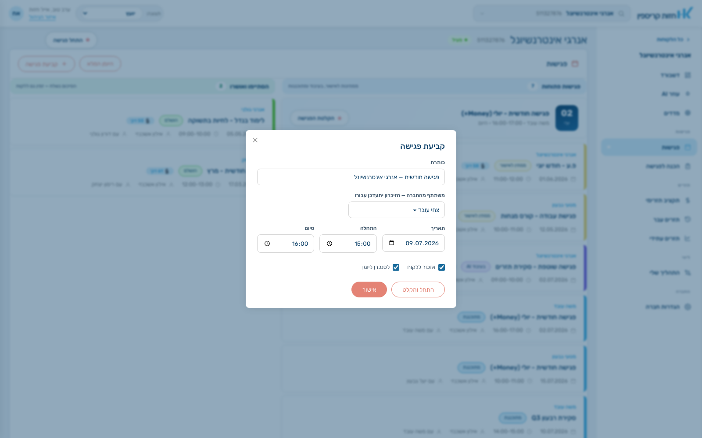

קביעה בשניות: כותרת אוטומטית, בחירת המשתתף מהחברה (כי הזיכרון מתעדכן פר משתמש — ואפשר להוסיף איש קשר חדש מאותו מקום), תאריך ושעות, אזכור אוטומטי ללקוח וסנכרון ליומן. ואם הפגישה עכשיו — "התחל והקלט" בכפתור אחד.

- **קוד:** `js/meetings.js` — `meetNew()`, `meetNewSave()`, `whoPicker()`
- **סטטוס:** עובד בפרוטוטייפ

## 16. בר טרום-פגישה

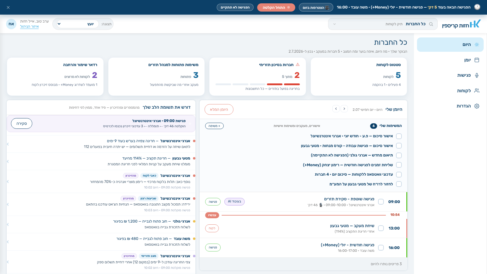

חמש דקות לפני פגישה, המערכת באה ליועץ: בר עליון עם פרטי הפגישה, הצטרפות לזום בלחיצה, "התחל הקלטה" — או "הפגישה לא תתקיים" שמסמן ומתזמן מחדש. ככה אף פגישה לא מתחילה בלי הקלטה, ואף ביטול לא נעלם.

- **קוד:** `js/meetings.js` — `showPreMeetBar()`, `pmbRec()`, `pmbNoShow()`
- **סטטוס:** עובד בפרוטוטייפ

## 17. הקלטה שלא עוצרת אותך

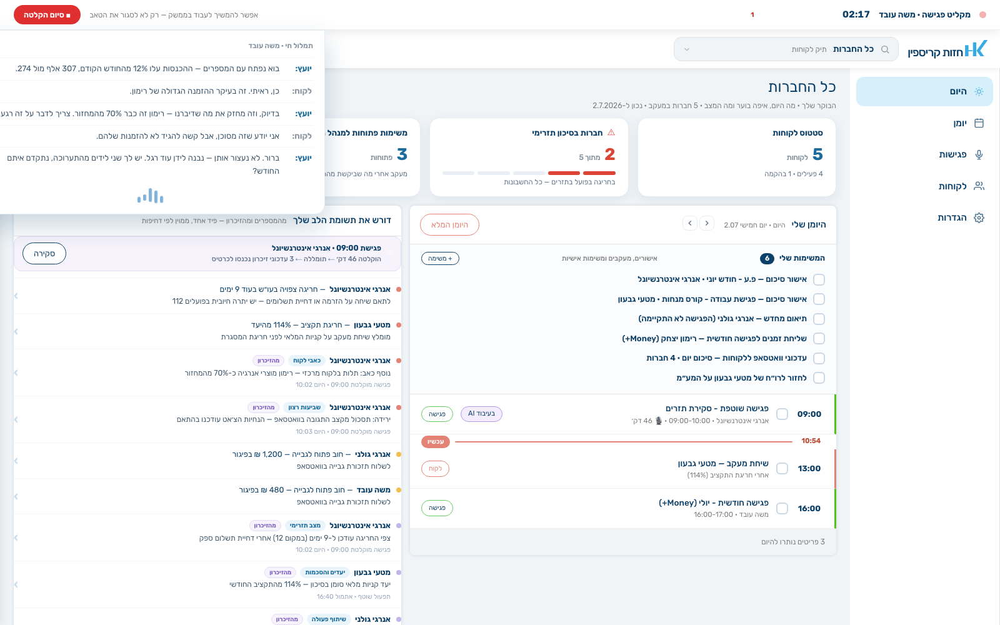

ההקלטה היא בר צף — לא מסך. היועץ ממשיך לעבוד: מראה ללקוח את הדשבורד, פותח את התזרים, בודק מספרים — והבר מלווה אותו בכל מסך עם טיימר, השהיה, וכפתור "⚑ רגע חשוב" שמסמן רגעים קריטיים שה-AI יתייחס אליהם בסיכום. רוצים להציץ בתמלול שנבנה חי? פאנל בלחיצה. סגירת הטאב בטעות? המערכת עוצרת אותך.

- **קוד:** `js/meetings.js` — `startMeetRec()`, `markMeetRec()`, `mrecTrTg()`, `stopMeetRec()`
- **סטטוס:** עובד בפרוטוטייפ

## 18. פגישה שטרם התחילה

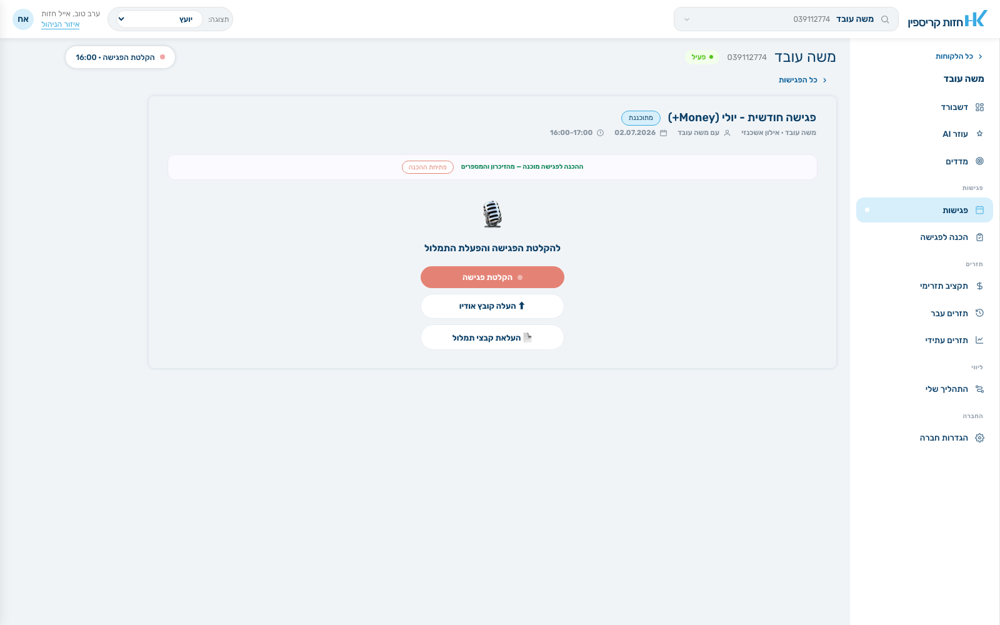

נכנסים לפגישה מתוכננת ורואים בדיוק מה שצריך: תזכורת שההכנה מוכנה (לחיצה פותחת אותה), ושלוש דרכים להתחיל — הקלטה חיה, העלאת קובץ אודיו, או העלאת תמלול קיים. כל הדרכים מובילות לאותו צינור עיבוד.

- **קוד:** `js/meetings.js` — `msPreStart()`, `msRecOpen()`, `msRecBegin()`
- **סטטוס:** עובד בפרוטוטייפ

## 19. עמוד הפגישה

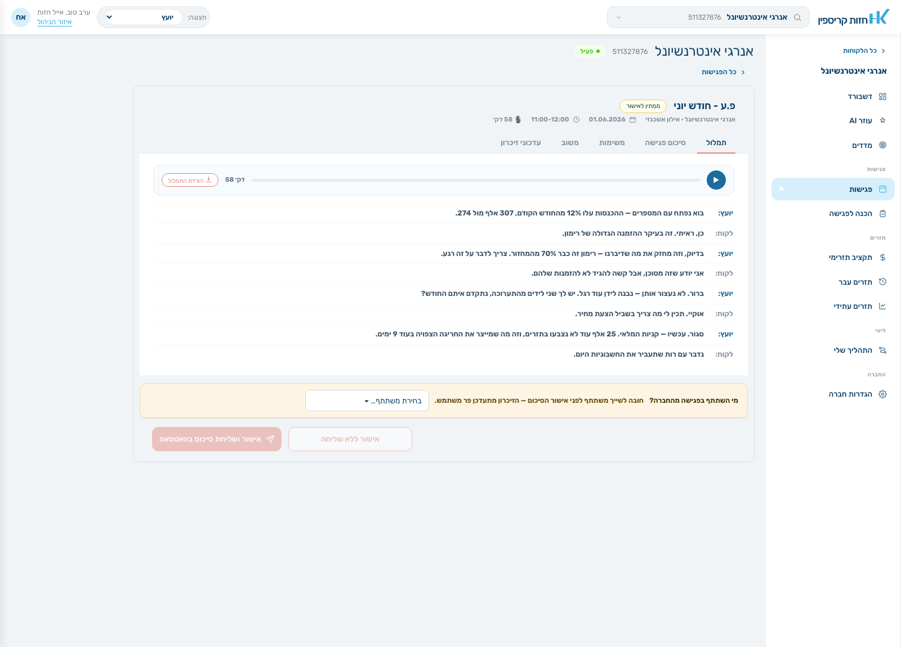
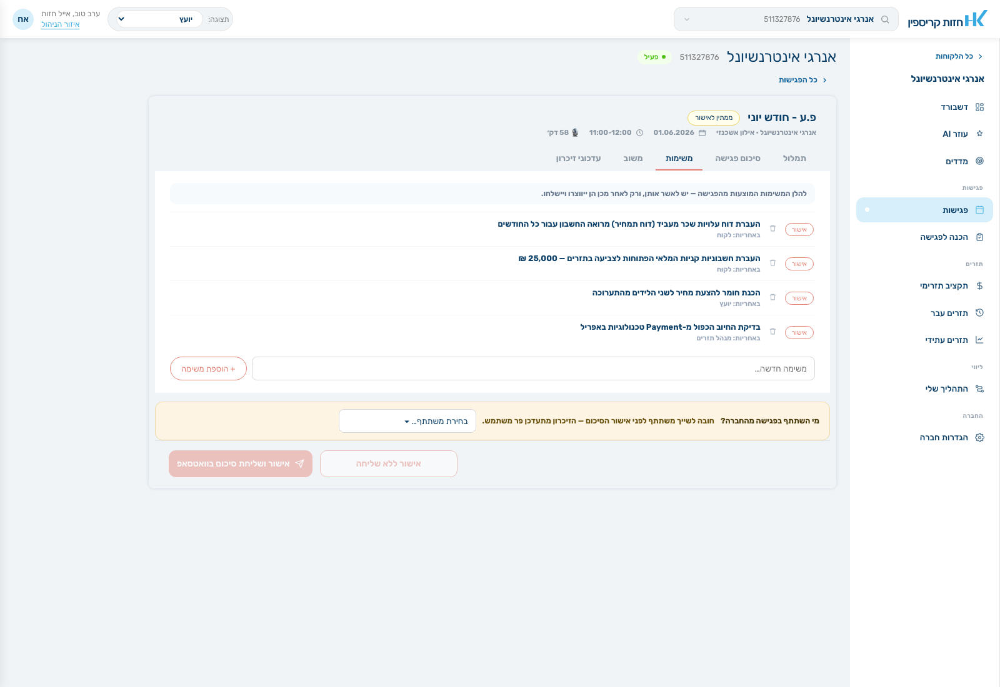

אחרי הפגישה הכל מוכן לבד: תמלול מלא עם נגן להאזנה והורדה, סיכום פגישה ערוך, ומשימות שה-AI חילץ — היועץ מאשר כל משימה, מוסיף משלו, ורק אז הן נוצרות ונשלחות. לפני אישור הסיכום המערכת דורשת לשייך את המשתתפים מהחברה (עד שניים) — כי הזיכרון מתעדכן פר אדם. לחיצה על "אישור ושליחת סיכום" — והלקוח מקבל הכל בוואטסאפ. אחרי האישור: ייצוא ל-PDF או שליחה חוזרת.

- **קוד:** `js/meetings.js` — `openMeeting()`, `msTranscript()`, `msTasks()`, `approveSummary()`, `msAddWho()`
- **סטטוס:** עובד בפרוטוטייפ

## 20. משוב AI ליועץ

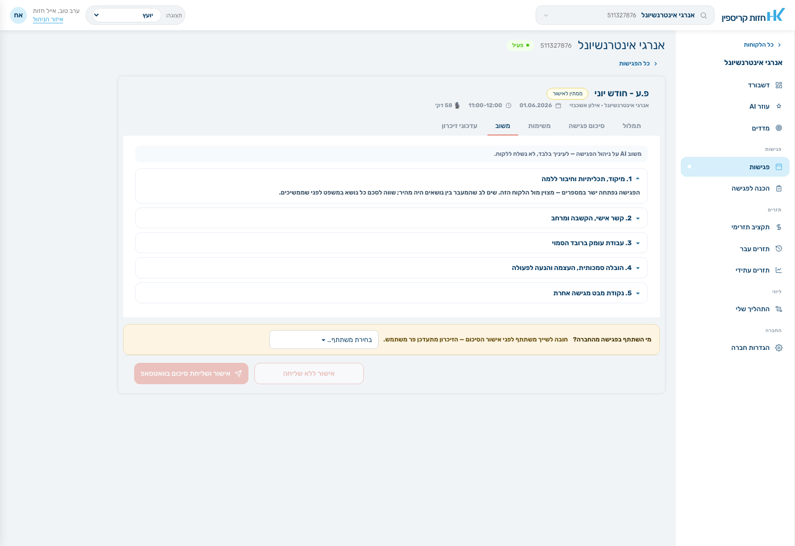

פיצ'ר שאין לאף מתחרה: אחרי כל פגישה, ה-AI נותן ליועץ משוב מקצועי על ניהול הפגישה — מיקוד וחיבור ל"למה", הקשבה ומרחב, עבודת עומק, הובלה והנעה לפעולה, ונקודת מבט אחרת. לעיני היועץ בלבד, לעולם לא נשלח ללקוח. היועץ משתפר מפגישה לפגישה.

- **קוד:** `js/meetings.js` — `MS_FB`, `msFeedback()`
- **סטטוס:** עובד בפרוטוטייפ

## 21. עדכוני זיכרון מהפגישה

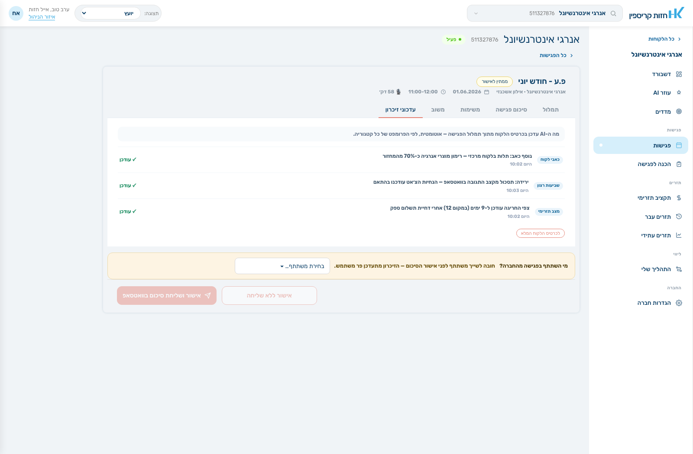

טאב שקיפות: מה בדיוק ה-AI עדכן בכרטיס הלקוח מתוך תמלול הפגישה — קטגוריה, שורת השינוי, ומתי. הכל אוטומטי, לפי הפרומפט של כל קטגוריה, עם קישור לכרטיס המלא. היועץ תמיד יודע מה המערכת יודעת.

- **קוד:** `js/meetings.js` — `msMemUpd()` · `js/memory.js` — `MEM_UPDATES`
- **סטטוס:** עובד בפרוטוטייפ

## 22. הכנה לפגישה

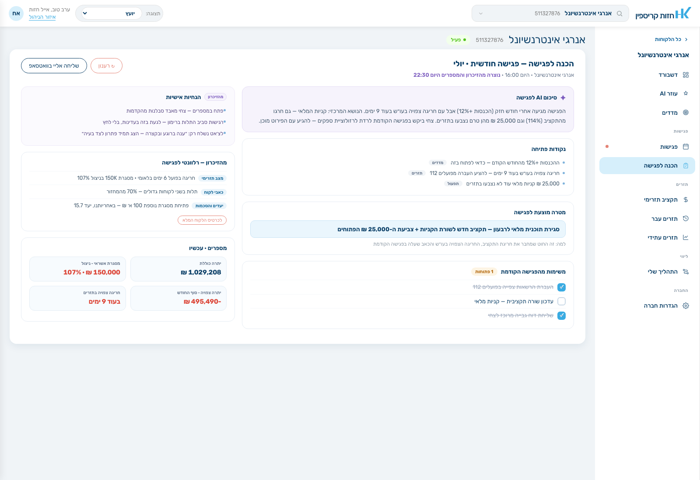

ההכנה לא נכתבת — היא נגזרת. בכל פתיחה המערכת בונה אותה מחדש מהזיכרון החי, מהמספרים העדכניים ומהמשימות הפתוחות: סיכום AI לפגישה, נקודות פתיחה עם תג מקור, מטרה מוצעת עם "למה", והנחיות אישיות ("פתח במספרים", "רגישות סביב התלות ברימון"). אפשר לרענן, ואפשר לקבל אותה לוואטסאפ לפני הפגישה.

- **קוד:** `js/meetings.js` — `renderPrepView()` · view: `#viewPrep`
- **סטטוס:** עובד בפרוטוטייפ

## 23. הגדרות חברה

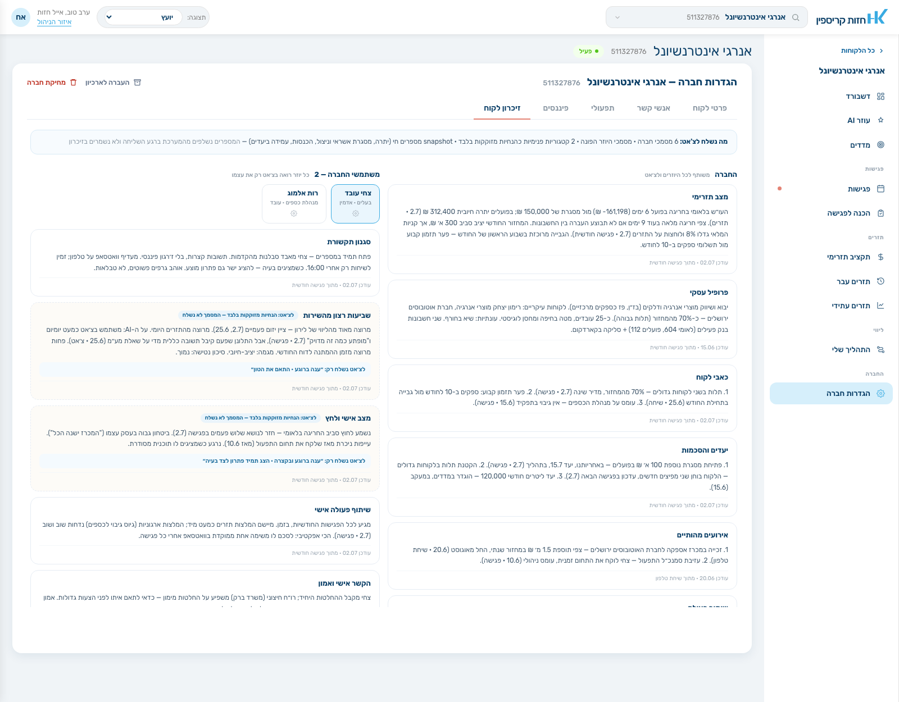

כל ניהול הלקוח במקום אחד, בתוך החברה: פרטי לקוח, אנשי קשר (עם 11 סוגי הודעות אוטומטיות לבחירה), תפעולי, פיננסים — וטאב זיכרון הלקוח המלא, כולל שורת שקיפות שמסבירה בדיוק מה נשלח לצ'אט ומה לא.

- **קוד:** `js/cosettings.js` — `renderCoSet()` · `js/memory.js` — `renderMemCard()` (דרך `MEM_HOST`)
- **סטטוס:** עובד בפרוטוטייפ

---

*כל הצילומים — מהפרוטוטייפ החי (`index.html`, תצוגת יועץ). מסמך אפיון מפורט למחזור חיי הפגישה: `meetings-brief.md`.*
